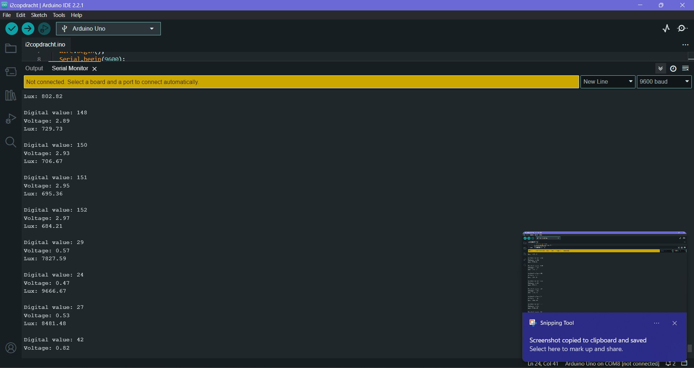
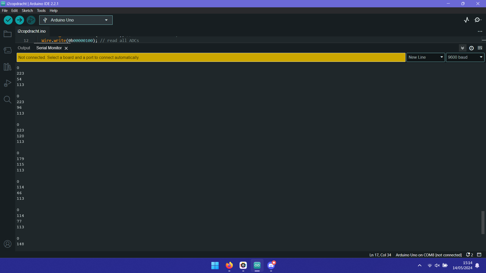

# Workshop I2C door Lia, Lisa en Aimance.C

Deze workshop doen we samen in de les.

## Plenair stukje

Leun lekker achterover en laat je alles uitleggen over I2c

## YL-40 boardje

  

Onderstaand vind je het schema van het bovenstaande YL-40 boardje. Stel dat je weet dat AIN staat voor "Analog In", probeer dan zoveel mogelijk aan de hand van het schema te beredeneren wat dit boardje doet / hoe het werkt.
  

## PCF 8591

De chip is een PCF8591, een via I2C protocol te besturen ADC chip.

## Opdracht Datasheet

Bestudeer de datasheet. Probeer de volgende key-data te vinden (schrijf het paginanummer op bij elke key-item, zodat je altijkd het makkelijk kunt terugvinden)

- Op welke voedinggsspanningen kan het werken?  
  **minstens 2.5V, max 6V**  
  Zou je het zonder level-shifters met een 5V microcontroller kunnen laten werken? En met een 3.3V microcontroller?  
  **ja, dat werkt beide zonder shifers**
- Wat is de sampling rate?  
  **11.1KHz**  
  Waarom is dat belangrijk om te weten?  
  **dan weet je hoe accuraat het is**
- Hoe kun je de waarde van een register uitlezen?  
  **een read signaal sturen en dan de SDA pin lezen**
- Hoe kun je efficent de waarden van een reeks registers uitlezen?  
  **je schrijft eerst met welk register je wil beginnen**
- Wat gebeurt er na opstarten (power-on)?  
  **alle bits van de control register worden naar 0 gezet en de D/A converter en oscillator zijn uitgeschakeld en de analog output wordt op een high-impedance state gezet**
- Hoeveel adresbits verwacht deze chip?  
  **7**
- Hoe lees je de laatst geconverteerde Analoog naar Digitaal conversie waarde uit?  
  **2 keer lezen, de laatste waarde is de laatst geconverteerde**
- Op welke manieren kun je de ADC-converters configureren?  
  **4 verschillende streams, drie differentiele, 2 vanilla en een differentiele, 2 differentiele**

## Opdracht: lichtintensiteit van de LDR uitlezen
Gebruik de standaard Wire library van PlatformIO (zelfde als van Arduino IDE) om gebruikmakend van de gegevens uit de datasheet de hoeveelheid licht die valt op de LDR te meten en als tekst naar de seriele monitor te sturen.

(Belangrijk: Met deze oefening oefen je het aansturen van een chip op basis van de gevonden data in de datasheet. Kopieer dus geen code voor de pcf8591 van een website of chatgpt - dan schiet je jezelf in je voet.)

Gebruik de I2C communicatie de standaard Wire library van de Arduino IDE. [Deze eerder als voorbereiding getipte webpagina](https://www.circuitbasics.com/how-to-set-up-i2c-communication-for-arduino/) laat met een voorbeeld zien hoe die library werkt. Debug en/of controleer de I2C signalen met behulp van je logic analyser.  
```cpp
#include <Wire.h>
byte value;
float toVolt = 5.0 / 256;
float voltage;
float lux;
void setup() {
  Wire.begin();
  Serial.begin(9600);
  Wire.beginTransmission(0x90 >> 1); //start transmission, communication with the PCF8591
  Wire.write(0b00000001); // read AIN1
  Wire.endTransmission(); // end transmission
}

void loop() {
    Wire.requestFrom(0x90 >> 1, 2, true);
    Wire.read();
    value = Wire.read(); 
    voltage = value * toVolt;
    Serial.print("Digital value: ");
    Serial.print(value); Serial.print('\n');
    Serial.print("Voltage: ");
    Serial.print(voltage); Serial.print('\n');
    Serial.print("Lux: ");
    lux = (1000 * (5-voltage))/ voltage;
    Serial.print(lux); Serial.print('\n'); Serial.print('\n');
    delay(1000);
```


## Opdracht: lichtintensiteit alle 4 de adc's uitlezen
Pas nu de code aan, zodat de waarden van alle 4 de adc's binnen dezelfde read worden uitgelezen en op de seriele monitor worden weergegeven.  
```cpp
#include <Wire.h>
byte value;

void setup() {
  Wire.begin();
  Serial.begin(9600);
  Wire.beginTransmission(0x90 >> 1); //start transmission, communication with the PCF8591
  Wire.write(0b00000100); // read all ADCs
  Wire.endTransmission(); // end transmission
}

void loop() {
    Wire.requestFrom(0x90 >> 1, 4 , true);

    for (int i=0; i <= 3; i++){
      value = Wire.read(); 
      Serial.println(value);
    }
    Serial.print("\n");
    delay(1000);
}
```
