# ESP32 LOGBOEK

## Opzetten en kennismaking ESP32
- Eerst moeten voor de opzet van de ESP32 een git clone uitvoeren, om nodige bestanden uit een Github repo te verkrijgen\
git clone -b v5.3 --recursive https://github.com/espressif/esp-idf.git esp-idf-v5.3

- Ik kreeg een fout code, mijn command prompt raadt mij aan de offline installer te gebruiken
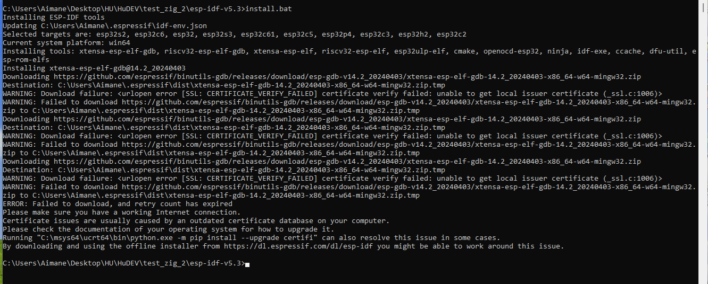

-Ik heb dus maar de offline installer gebruikt
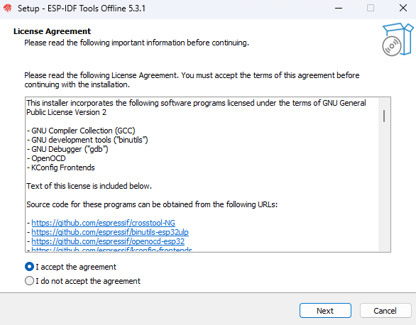

- Nu dat het geinstalleerd is heb ik 2 desktop shortcuts voor de de ESP-IDF in Cmmd prompt en powershell

- De versie klopt 
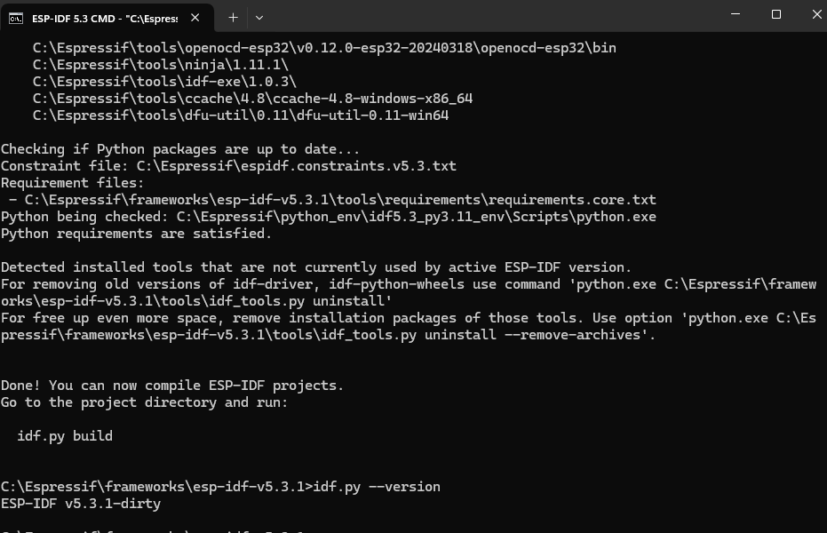

- Weet dat de USB communicatie soms drivers nodig heeft voor de communicatie met een microcontroller

- Ik heb hard m'n best gedaan om idf.py set-target esp32 te runnen, maar dit werkte niet. Vervolgens las ik de fout code verkeerd en daarna goed. Ik moest de set-target command uitvoeren in 1 van de example projecten, dit heb ik dus gedaan in get-started
Fotos die er bij horen:
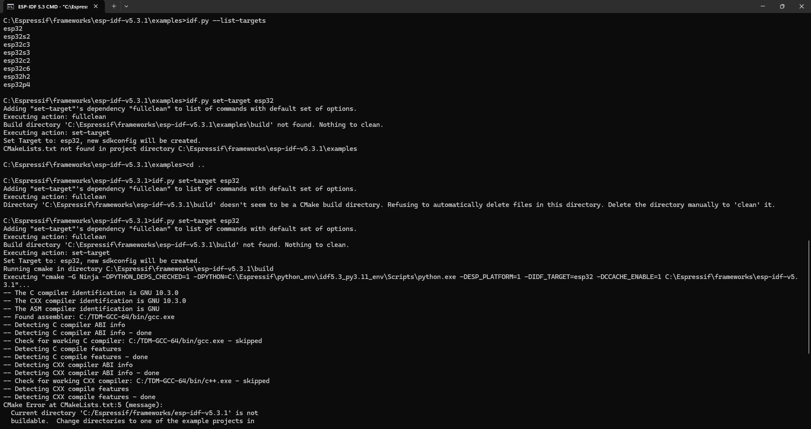
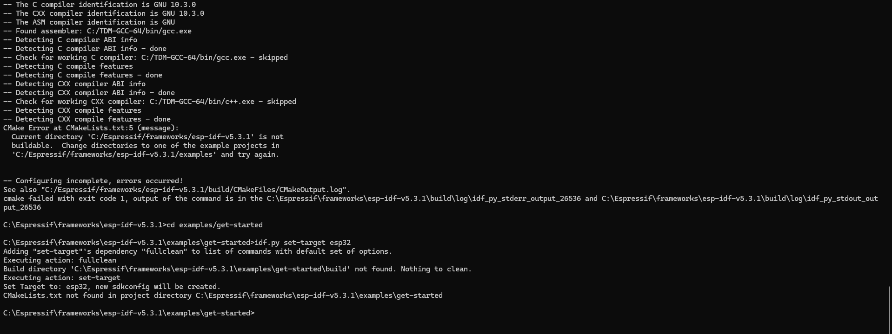

- in je device manager, nederlands apparaatbeheer je com port checken in mijn geval was het nu com4
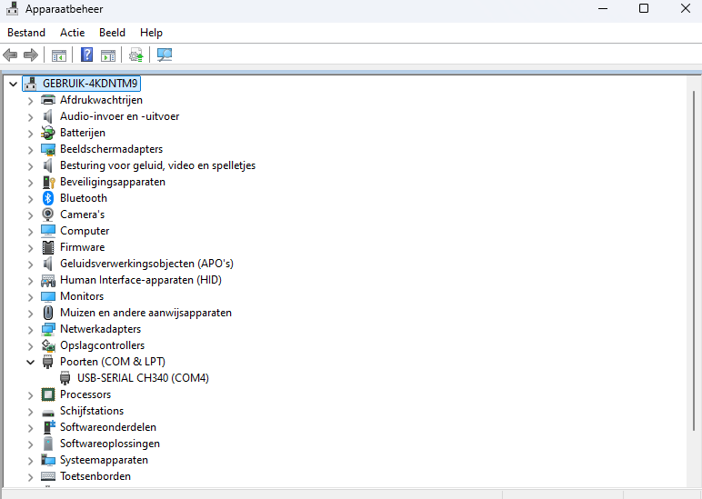

- Het is gelukt de hello world te runnen!
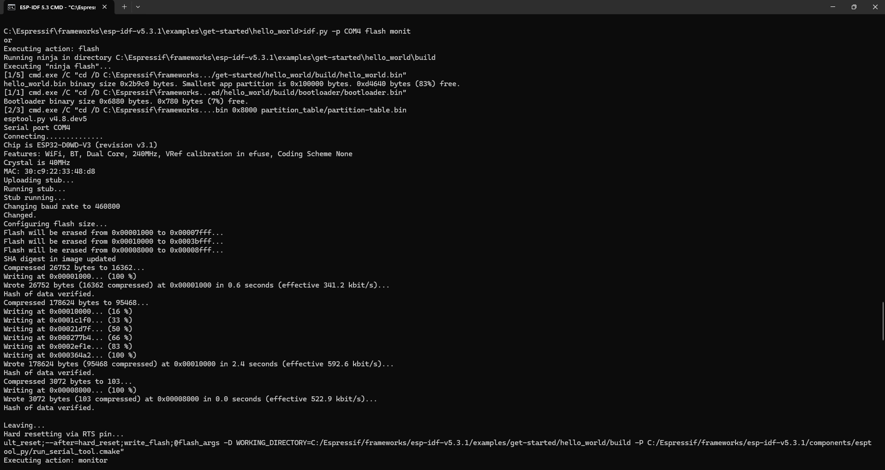
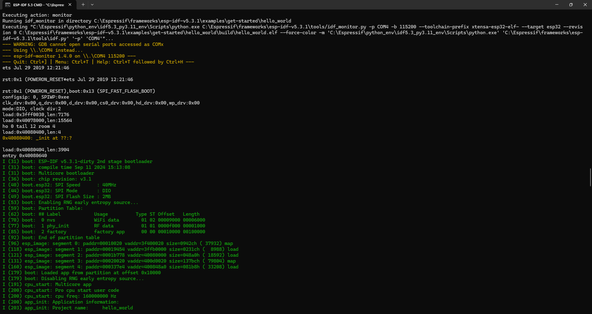
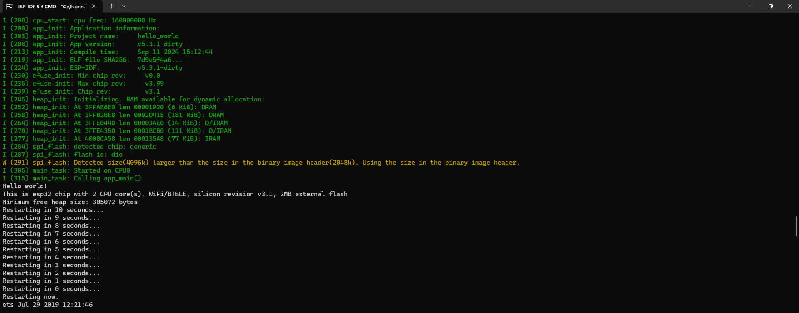

- Nieuw project maken;
Het is gelukt!
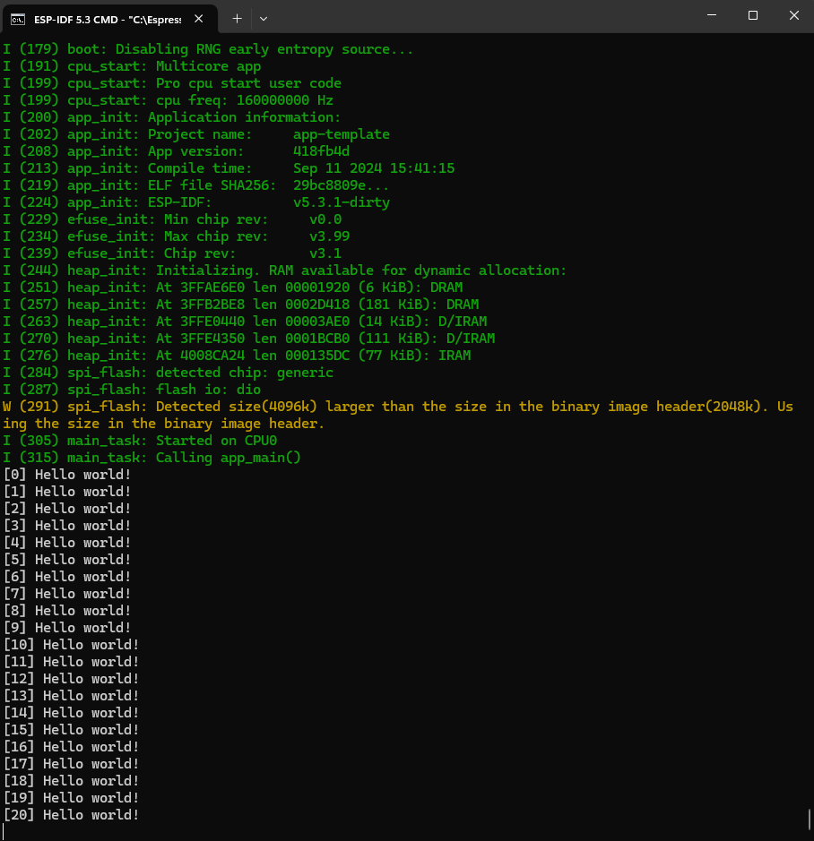

- Om uit de loop te komen gebruik "CTRL" + "]"

## Lasergame template object
- De git repo is gecloned naar mijn framework map\
Nu alleen rekening houden met de idf.py set-target esp32, dat moet altijd

- Voor dit voorbeeld krijgen we een foutcode zoals aangegeven staat in Marius zijn documentatie

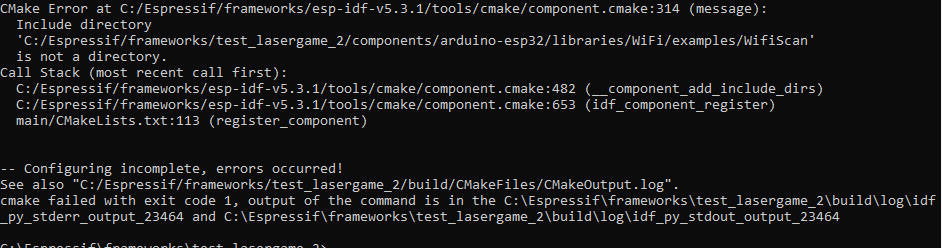

- In de documentatie staat het volgende; "Voor compatibiliteit met de arduino IDE components moet de freertos periodieke timer op 1000 HZ worden ingesteld (zodat VTaskDelay(1) 1 ms duurt ipv 10ms)."

- Dit passen we handmatig aan in de sdkconfig file door het te openen als een notepad
- BELANGRIJK! Daarna is geen verdere actie nodig. Dus niet opnieuw set-target aan roepen - die vervangt sdkconfig weer terug!!!!!!!!!!!!!!

- Ik loop tegen deze zelfde error aan de hele tijd en ik weet totaal niet waarom
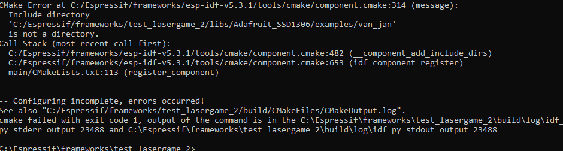

- Ik ga alles verwijderen en opnieuw beginnen

- De fout zat in directories die niet bestonden, die heb ik allemaal in de CmakeList uitgecomment!
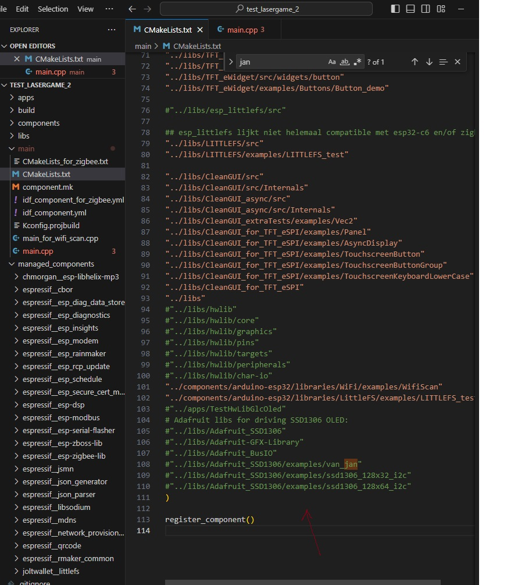

- Wifi fout, NVS fout! Wat kunnen we hier aan doen?
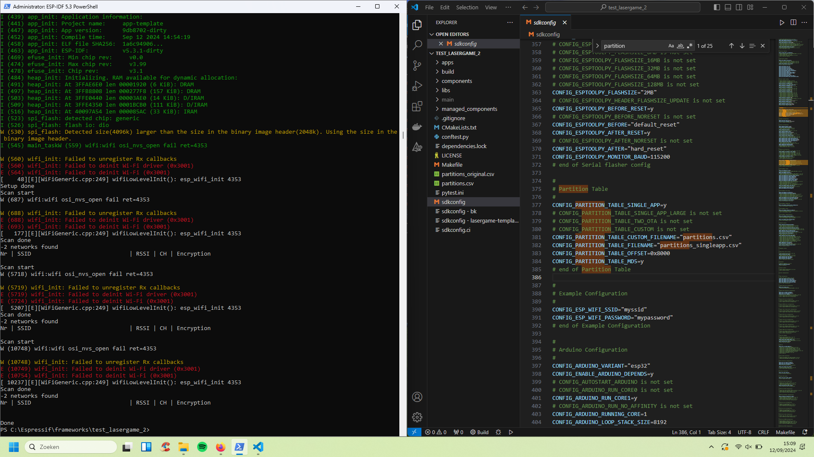

- Probeer C:\Espressif\frameworks\esp-idf-v5.3.1\examples\wifi\scan misschien werkt de Arduino library gewoon niet zo goed als de ESP library

- CmakeList is een lijst met files die gebouwd moeten worden

- De wifi andere wifi scan werkt wel!
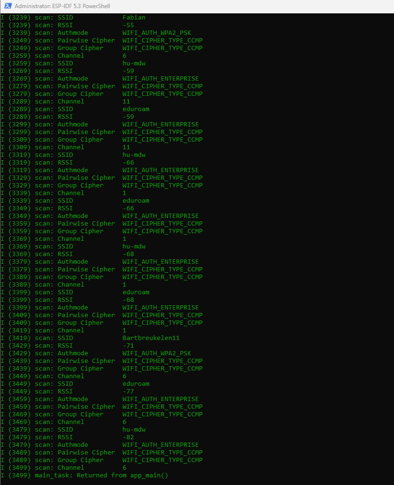