# ESP32 LOGBOEK

## Opdracht networking basics

Tags:
[fouten]
[feedback]
[opmerkingen]

- Ik open de Arduino IDE om op de ESP32 libraries te downloaden. Deze zijn nodig om de ESP32 via de Arduino IDE te gebruiken.

    ### Hello World
    - Aan Niels vroeg ik of ik de juiste drivers voor de ESP32 aan het downloaden was op mijn Arduino IDE. Ik probeerde de Arduino Nano ESP32 te downloaden, maar die moest ik niet hebben. Ik moest de ESP32 Dev Board hebben.

    - __Ik maakte de fout geen Serial.begin(115200); aan te geven.__ Dit gaven Rezan en Niels aan! [fouten]

    - Na de baudrate aangepast te hebben krijg ik Hello World te zien in de monitor
    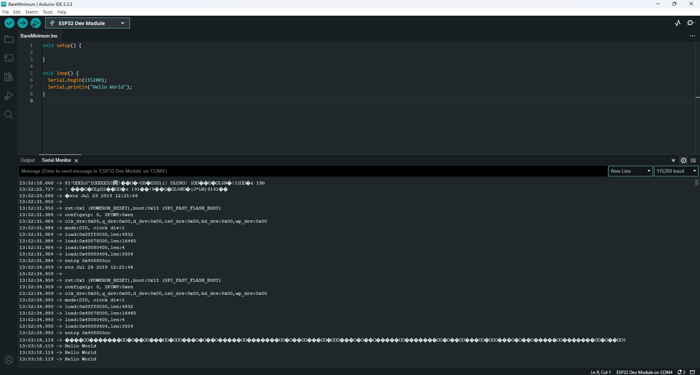

    - De Hello World staat in de loop, en daarom wordt de hello world nu letterlijke elke microseconde gepost in mijn Serial Monitor [opmerkingen]
    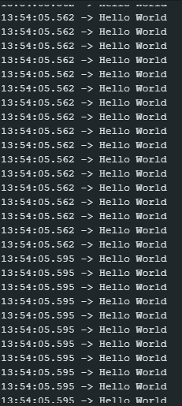

    - De examples die ik kan gebruiken voor het testen van de ESP32 kun je op de volgende manier vinden: 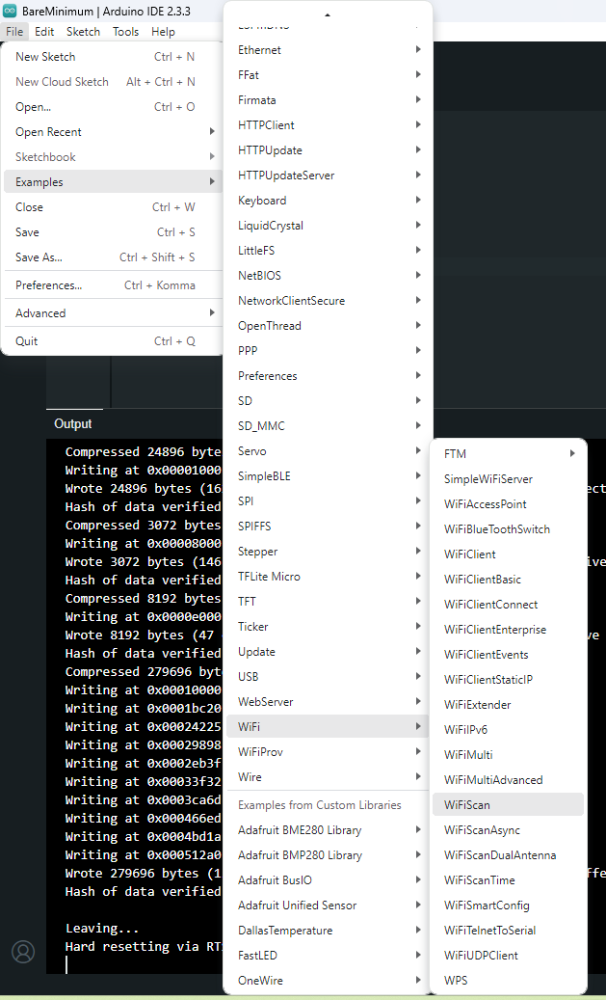 [opmerkingen]

    ### WifiScan
    - De WifiScan was te vinden in de examples en werkte meteen! De WifiScan zag er uit als volgt: 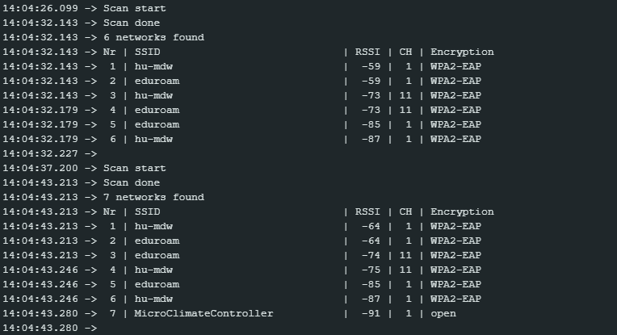

    ### Internet access
    - Voor de volgende example gebruik ik mijn hotspot!

    - Eerst kijk ik met de eerdere WiFiScan of ik de hotspot kan vinden, zo niet dan ga ik verder met de opdracht als ik thuis ben. Daar maak ik dan gebruik van het thuisnetwerk.

    - We zien dat "AimanePhoto" beschikbaar is, dus dat is het netwerk waarmee we gaan verbinden.
    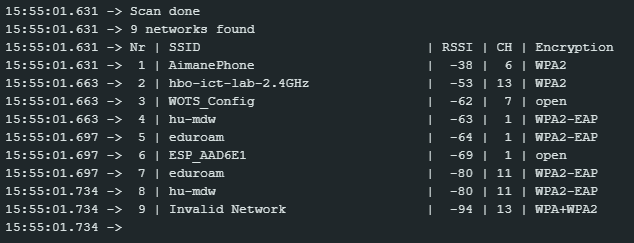

    - Ik verander de nodige gegevens om een verbinding te maken met de nodige SSID.
    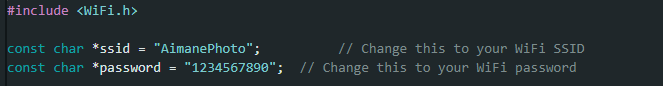

    - Er lijkt geen connectie gemaakt te worden, waarschijnlijk werkt de ESP32 niet goed met een telefoon hotspot, hierom ga ik dit later 
    

    - Thuis heb ik opnieuw een WifiScan uitgevoerd en kan mijn router terug zien, namelijk Tossa 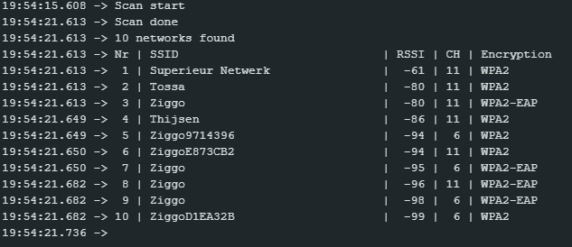

    - Nu probeer ik opnieuw te connecten met Tossa, door de SSID en wachtwoord in te voeren 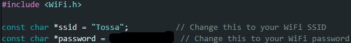

    - Het was gelukt om een connectie te maken! 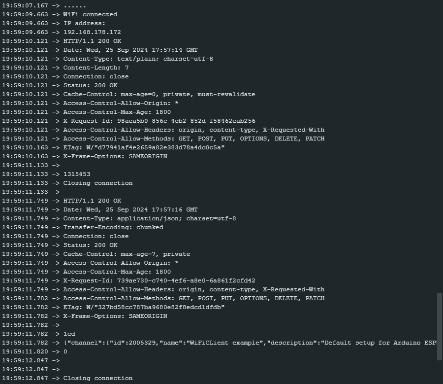

    ### WifiAccesPoint
    - GPIO 2 is volgens mij als ik het goed gegoogled heb de pin die gebruikt wordt om de built-in LED te besturen.

    - Ik heb de SSID veranderd naar een herkenbare naam; "AimaneESP32"

    - Op mijn telefoon is de AccessPoint te zien: [Foto van me tellie]

    - Vervolgens lukt het mij om via het IP adres dat in de comment van de code staat een web page te openen waarmee ik de LED van mijn ESP32 aan en uit kan doen

    - Fotos; 
        - ESP32 getoond in lijst van wifi verbindingen: 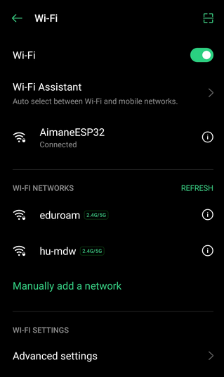
        - IP adres verwijst naar website website waar ik de LED uit of aan kan doen
    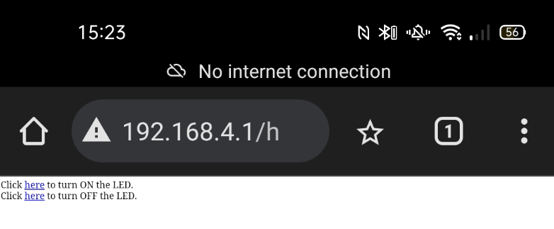

        - LED van de ESP32 staat aan
    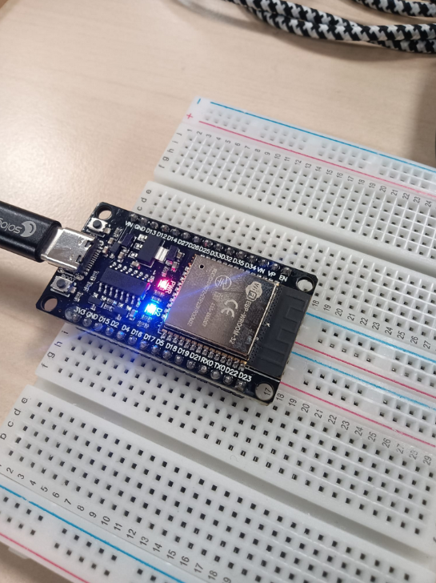