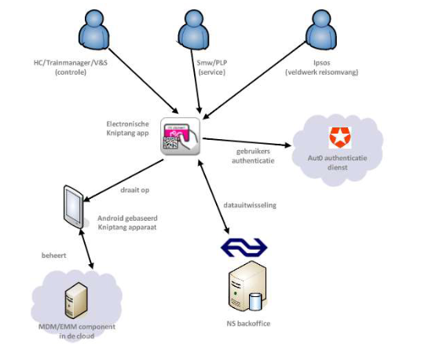

# AANTEKENINGEN WEEK A1, PAGINA 15 TOT EN MET 26

- 

---

## System Context

- Om snel wat overzicht te krijgen van wat er allemaal samenhangt met een systeem, kun je
een Systeem Context Diagram tekenen.
__Een definitie van zo’n diagram is:
“A System Context Diagram (SCD) in engineering is a diagram that defines the boundary
between the system, or part of a system, and its environment, showing the entities that
interact with it.”
“IT is The High Level View of a System”
(www.en.wikipedia.org/wiki/System_context_diagram)__

---

- Een voorbeeld van zo'n diagram is onderstaand context diagram voor een electronische kniptang app:

    - In het midden staat het zogenaamde __"Systen of Interest"__ Dit systeem is het middelpunt van onze analyse.

    - De __overige elementen__ bevinden zich buiten het systeem. 
    
    - Een goed context diagram is zo helder mogelijk. De volgende eigenschappen kunnen helpen om dat te bereiken:
        - Verduidelijkende iconen.
        - Berp de hoeveelheid externe elementen
        - Relaties verduidelijken met een beschrijving
        - Een werkwoord in de 3e persoon zoals in het voorbeeld draait op of beheert wordt gebruikt
        - __Wederzijdse__ relaties met dubbelzijdige pijlen aangeven
        - Bij __wederzijdse__ relaties die __niet symmetrisch__ zijn kun je verschillende beschrijvingen langs beide uiteinden zetten

---
    
## Stakeholders

- __Stakeholders__ zijn alle __personen of entiteiten__ die een __belang__ hebben bij je product/project. Ook wel __belanghebbenden__.

- Voorbeelden van stakholders:
    - De opdrachtgever, de klant, de gebruiker.
    - Een speelgoedmerk kan als __opdrachtgever__ een opdracht geven zoals het maken van speelgoed. De __klanten__ in deze situatie zijn ouders en de __gebruikers__ kinderen.

- Hoe brengen we stakeholders en hun belangen in kaart?
    - 1 __identificeren__: We proberen zoveel mogelijke __stakeholders__ te ontdekken.
    - 2 __doelbepalingen__: Per __stakeholder__ inventariseren we welke __belangen__ ze hebben met het product.
    - 3 __classificeren__: We ordenen de gevonden __stakeholders op invloed en betrokkenheid__. Op basis daarvan kunnen we bepalen wat de belangrijkste stakeholders zijn. Dat is belangrijk, dan kunnen we tijdens het design rekening houden met hun __belangen__.

## Stakeholders identificeren
- Stakeholder __wheel__
    - Het “stakeholder wheel” is niets meer dan een lijstje van veel voorkomende stakeholders dat
je even kan turven als onderdeel van je effort om zoveel mogelijk stakeholders in kaart te
brengen: 
        - Leveranciers, Leidinggevenden, Medewerkers, Managers, Eigenaren, Concurrenten en Klanten

- Stakeholder __nominatie__
    - De stakeholders die je al gevonden hebt, kun je vragen of zij nog andere mensen, groepen,
organisaties of afdelingen kennen die te maken krijgen met het systeem

- Stakeholder __achtergrondonderzoek__
    - Op de stakeholders die gevonden zijn kun je onderzoek op verrichten. Daardoor kom je te weten of er meer stakeholders en partijen zijn voor jouw product.
        - Wie er in de markt actief zijn
        - Wie er betrokken zijn bij het product
        - Welke belangen zijn er

## Stakeholder doelbepalingen
- Vinden van de belangrijkste belangen die stakeholders hebben

- __View point hopping__, beurtelings doe je de pet van de stakeholder op en probeer je vanuit hun gezichtpunt te kijken wat je belangrijk vindt

- Een voorbeeld door het gebruiken van een MRI scan: 

## Stakeholder classificeren
- Niet alle stakeholders zijn even belangrijk, classificeren helpt te bepalen welke stakeholders je wel en niet betrekt bij het realiseren van jouw product

- Er zijn twee methoden
    - Een onion model
    - Een invloed versus betrokkenheid diagram

- Voorbeeld:

- Het Onion model bestaat 4 ringen, van binnen naar buiten:
    - 1: __Systeem/product__
    - 2: __Actoren van het systeem__: Stakeholders die werken met of direct interactie of belangen hebben met het systeem
    - 3: __Business stakeholders__: Stakeholders binnen de organisatie die niet direct interactie hebben met het systeem maar wel baat bij hebben    
    - 4: __Omgeving__: Stakeholders die zich buiten het bedrijf bevinden maar nog steeds belangrijk zijn en effect hebben op het systeem

    - Je ziet ook __gestippelde pijlen__ in het onion model, om de relaties tussen stakeholders te weergeven.

- Stakeholder invloed versus betrokkenheid
    - __Invloed__: De mate van invloed va nde stakeholder op de besluitvorming, voorbeeld: Door wettelijke beperking te stellen heeft een wetgever hoge invloed

    - __Betrokkenheid__: Hoeveel belangen de stakeholder heeft bij de uitkomsten, voorbeeld: Een mogleijke uitkomst voor een pacemaker is dat de batterij lang mee gaat dat is belangrijk voor de patient

    - Voorbeelden van diagrammen die je kunt maken:

## Key drivers en application drivers
- Wat wil de klant? - Deze doelen noemen we "key drivers"

- Wat willen de andere stakeholders? - In CAFCR worden die doelen "concerns" genoemd

- Welke (sub- / meer specifieke) doelen volgen uit de key drivers? - in CAFCR worden dat “application drivers” genoemd.

# AANTEKENINGEN A2, PAGINA 34 T/M 40

## Use cases

- Een use case is:\
    1: Een __samenhangede reeks__ van acties\
    2: Die door het systeem worden uitgevoerd om ...\
    3: ... aan een __doel__ van een __actor__ te voldoen\ 

- Actors:
    - Iets of iemand die __buiten het systeem bestaat.__
    - Deelnemer in de __samenhangede reeks van acties.__
    - Voorbeelden van actoren: Eindgebruikers, andere systemen, meetbare grootheden zoals de temperatuur, hoeveelheid zonneschijn etc.

- Use case diagram
    - Verband tussen use cases en actoren visualiseren via een use case diagram.
    - Mogelijke relaties tussen use cases onderling:
        - __Include relaties__; Als de ene use case wordt uitgevoerd wordt de andere ook uitgevoerd.
        - __Extend relaties__; Als de ene use case wordt uitgevoerd __KAN__ de andere ook uitgevoerd worden.
        - __Specialisatie relaties__; Use cases kunnen ook van andere use cases overerven. Dit zie je echter zelden.

- __Voorbeelden; te vinden op pagina 36 en 37 van de reader__

- Use case beschrijvingen; elke use case krijgt een aparte beschrijving voor verduidelijking.
Voorbeeld: 
    - Onderdelen van een use case beschrijving zoals op de foto:
        - __Identificatiecode__ (UC03) met een naam.
        - __Actoren__ die betrokken zijn.
        - __Scenario__, omschrijving van veel/meest voorkomende en verawchte interactiereeks. Als er meerdere scenarios zijn kun je meerdere scenarios beschrijven (Scenario 1, Scenario 2)
        - __Preconditie__ een voorwaarden om de usecase te kunnen starten. Het moet niet triviaal zijn zoals; "het apparaat is niet kapot."
        - __Postconditie__ Niet triviaal resultaat/gevolg van de use case.
        - __Uitzondering(en)__ nodig om te beschrijven wat het gewenste gedrag afbreekt.
        - __Invariant__ een regel die tijdens de usecase bij voortduring geldig is.

# AANTEKENINGEN A2, PAGINA 40 T/M 46
# SysML Activity diagram

- Activity = gedragsreek, bestaan uit acties control flows etc.

- Action Node = Stap binnen een activiteit.

- Control flow = Geeft volgorde van ene naar andere actie met een pijl.

- Initial node = Start punt

- Objects en object flows = Pad waarlangs objecten of data kunnen passeren

- Final nodes = Twee soorten
    - Activity final = Dit bereiken stopt ook alle andere flows
    - Flow final = Het stopt alleen de betreffende flow binnen de activity, andere gaan door

- Fork = Een ingaande node met meerdere uitgaande nodes

- Join = Meerdere nodes die samen komen in 1