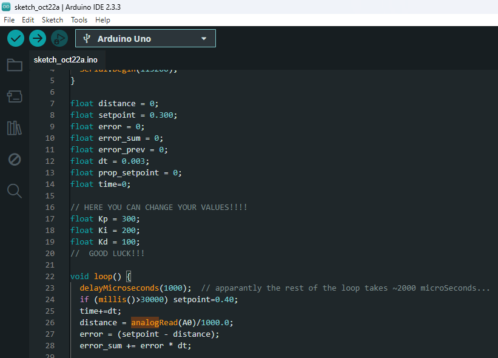
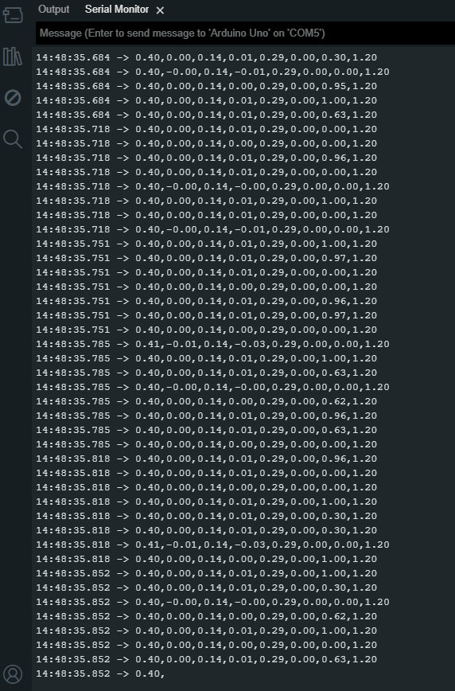

## Logboek voor het practicum

- Ik heb de opstelling vlekkeloos gebouwd.

- Na het uploaden van de code op de arduino IDE bekijk ik eerst hoe de code werkt
    - Eerst worden er allemaal floats gedeclared.
        - Tussen die floats staan de KP KI en KD
        - Bij de KP KI en KD staat er in de comments dat dit de stuk code is die je mag aanpassen
    - Vervolgens begint de void met de formule die nodig is voor PID, dit herken ik aan het gebruik van termen zoals dt en error
    
    - Daarna volgen een heleboel print statements waarin je de de berekende gegevens kunt zien volgens mij

- Ik upload de code en kijk of er wat verandert als ik op line 55 de 255 / 100 verander in 255 / 50

- Ik zie dat ik een fout heb gemaakt, ik ben vergeten de baudrate in mijn seriele monitor aan te passen om te zien wat er gemeten en berekend wordt.

- Wanneer ik handmatig de opstelling op en neer beweeg zie ik dat de waardes die in de seriele monitor worden geprint veranderen.
    - Zo gaat het getal die de distance aangeeft omhoog
    - Zo gaat het getal voor de error omlaag

- Schatting maken van KP KI en KD; ziegler nicols en 

- Kijken naar de error sum om te zien hoe fout het balanceren is en hoe langzaam het uitbalanceren gaat!

- SCREENSHOT CODE EN SERIELE MONITOR:

