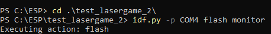

## PONG OPDRACHT

### Opzet
- Bewijs dat ik Pong draaiende heb gekregen:

De logger knop werkt, maar de links en rechts knoppen hebben geen effect.

- Foto van mijn opstelling:
Ik had een dunne breadboard dus kan de opstelling misschien apart lijken.

### Object Model
- ballControl:
    - Bepaalt de positie en grote van de bal
    - Laat weten wanneer de padle de bal heeft gemist

- gameControl:
    - Herkent wanneer er knoppen worden geklikt
    - Laat weten wanneer de game begint
    - Lijkt aan te geven in welke state van de game we zijn

- paddleControl:
    - Herkent wanneer er knoppen worden geklikt
    - Verwerkt de knoppen waardoor de paddle bestuurd kan worden

- sceneDisplayControl:
    - Zorgt voor het visuele onderdeel van de game en toont dat op een scherm

### Debugging
- Eerst haal ik de comments weg om de logger te gebruiken

- Ik zie hoe de logger aantoont dat het spel vast blijft zitten in de INITIAL state! Hier moeten we dus wat aan doen
- 

- We passen dus de code aan zodat het spel de INITIAL state kan verlaten!

- Er ontbreken ESP_LOGI functies, deze zijn logberichten

- De void enable() functie in SceneDisplayControl stond leeg, hier moet een flagEnable.set() staan!

- In PaddleControl.h staat er 2x left in plaats van 1x left en 1x right in de functie buttonPressed

- Ik probeer nu de fix te flashen, maar krijg de hele tijd een CMakeList error
- 

- De error had te maken met een defecte USB kabel die ik heb, de COM port verscheen en verdween constant uit mijn device manager lijst, wanneer die verdween kwam de error naar boven, wanneer die er weer tussen stond kon ik de idf.py -p (COM PORT) flash monitor uitvoeren.

- Nu werkt alles perfect!
