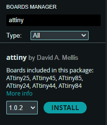
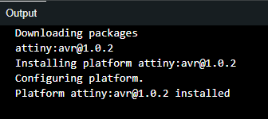
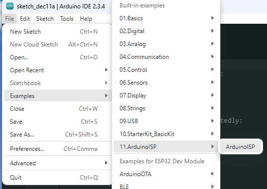
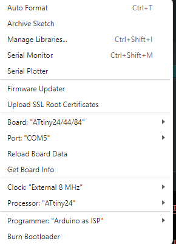
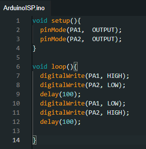

# Programmar practicum

## Hello World!
- We beginnen met toevoegen van de ondersteuning voor de ATtiny24.

- Vervolgens installeren we de bijhorende attiny board van David. A Mellis

- Daarna selecteren wij de Arduino ISP

- Na het bouwen van de opstelling, gebaseerd op het tabel en het plaatje uit de datasheet die in de markdown staat uploaden we de Arduino ISP code naar de Arduino Uno.

- Vervolgens stellen we de IDE in

- Het doen van de "Hello World" opdracht is gelukt. Hiervoor heb ik de volgende code gebruikt;

[Fotos van lampjes]

## 50Hz detector
- Nu gaan we werken aan de 50Hz detector opdracht!

- We bouwen eerst de opstelling!

- We switchen de clock naar internal 1Mhz

- Het werkt!

- Hoe werkt het?
    - De spoel vangt spanning op uit de lucht, des te meer het opvangt des te meer lampjes er aan gaan

[Fotos van lampjes]

## Audio prakticum
- We bouwen de opstelling

- Wat valt je op? Hoe klinkt het muziekje?
    - Het klinkt naar letterlijk niks, het klinken als 2 tonen en een korte pauze. Ook high pitched.

- Vervolgens maak ik de 2de opstelling met een weerstand en condensator. Het geluid klinkt nu zachter en minder high pithced. 

[Foto van de nieuwe opstelling]

- Waarom is dit geluid nu anders?
Omdat het zonder condensator en weerstand meer een blokgolf is, nu met condensator en weerstand vormt het zich meer als een sinus waardoor het geluid plezanter is!

- Nu neem ik mijn opstelling mee naar de oscilloscoop en vergelijk ik het signaal.
    - Je ziet dat zonder een condensator de blokgolven veel sneller zonder beleid gevormd worden en dat de toppen van de blokgolven heel chaotisch zijn met vele uitschieters. Met een condensator worden de blokgolven meer met een curve gemaakt, dit maakt het geluid ook plezanter.

- Berekening RC filter;

- Als je de clock speed weer terug veranderd naar 8Mhz dan hoor je jingle bells