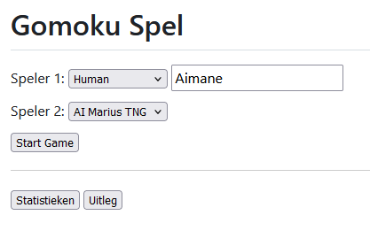
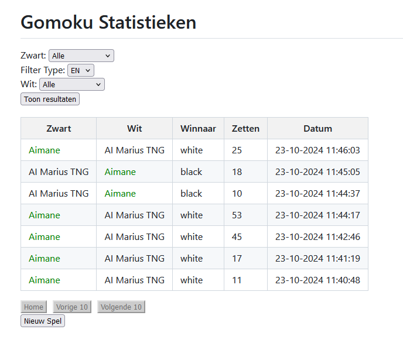
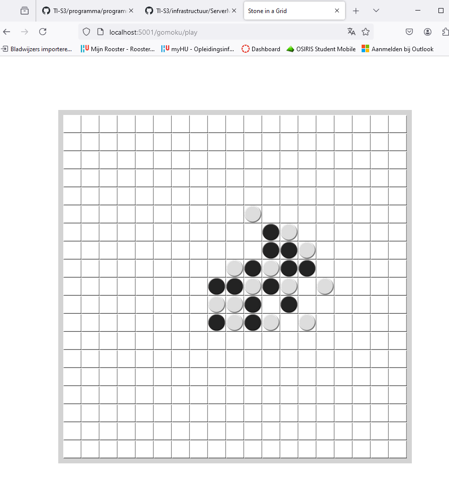
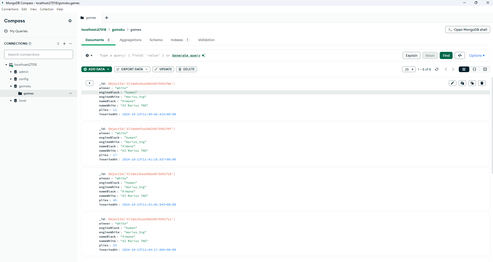

- Instellen van de game

- `Bewijs dat ik meerdere potjes heb gespeeld, allemaal verloren!`

- Een mid-game screenshot van de werkende webapplicatie.

- Maak een screenshot van de inhoud van een geregistreerde, gespeelde game in een database entry van MongoDB atlas.
    - Dit is hoe het er uit ziet in de applicatie
    

    - Dit is hoe het er uitziet in MongoDB
    

- Licht toe wat er is opgeslagen.
`Wat er is opgeslagen is best voor de handliggend! Er is een ID opgeslagen, zodat elke opgeslagen game een primary key heeft. Vervolgens staat er opgeslagen wie er gewonnen heeft. Vervolgens is er te lezen of zwart of wit door een AI bestuurd wordt, de Marius AI of door een speler met de opgegeven naam van de spelers. Plies staat voor het aantal zetten die gedaan zijn en insertedAt staat voor ingevoerd op met de dag en tijdstip waarop de game resultaat opgeslagen is! Alles wordt in het JSON format opgeslagen`

- Kijk Flask code in app.py door, en geef een korte beschrijving van je indruk over hoe Flask in zijn algemeen ongeveer werkt.
    - `@app.route geeft de web paginas aan!`
    - `Er worden functies geschreven en het lijkt er op dat wat je returned te zien is op de webpagina`

- Bestudeer de docker-compose.yml en de Dockerfile files. Leg in detail uit wat de regels uit deze files doen en hoe ze samenwerken.
    - `De docker-compose lijkt zowel de mongo database als gomoku game te beheren!`
    - `Nadat ik in de gomoku map nano Dockerfile uitvoer kreeg ik text te zien, niet al te veel. Dit lijkt in te stellen wat docker moet doen met de python bestanden, dit is bijvoorbeeld te zien op de line CMD ["python", "app.py"]`

- Geef een samenvatting van hoe een (officieus) Page Design Model de opbouw en het gedrag van een webpagina beschrijft.
    - `De kleuren die de page design gebruikt toont waar de blokken vandaan komen, blauw voor HTML, groen voor JavaScript.`
    - `Het werkt als een soort van activity diagram/STD die aantoont hoe de webpagina draait!`