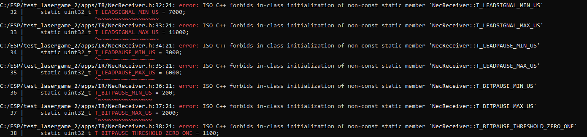

## Wat is deze opdracht?
In deze opdracht leren wij een STD om te zetten naar code, hiervoor moeten we de STDs aflezen, de functies overnemen en de states goed verwerken. De veranderingen van deze states zijn van belang, omdat die bepalen in wat voor toestand de hardware applicatie zich bevindt. Voor deze STD maken we gebruik van het infrarood NEC protocool.

Na het schrijven van de STD code is het de bedoeling om te kijken of de code ook echt werkt.

## Wat is NEC?
NEC is een communicatieprotocol voor infrarood. 
Infrarood wordt gebruikt om draadloos gegevens en data te verzenden via infraroodlicht. Dit wordt gedaan door gecodeerde signalen naar een infrarood verzender te versturen.
Het protocol bepaalt hoe de gegevens worden gecodeerd, verzonden en geïnterpreteerd. 

## Schrijven van de STD
- Ik merk op dat ik de lijntjes wil volgen en gelijk wil gaan schrijven, dit is wel een valkuil. Het is misschien goed om de nodige variabelen eerst te noteren voordat ik ga werken aan de switch cases.

- Ik besluit om voor beide STDs eerst de nodige variabelen te noteren voordat ik aan de slag ga met het schrijven van de switch cases.

- Ik merk op dat tijdens het schrijven van de STDs ik vanwege de vele variabelen die er zijn verward raak, het zou handig zijn geweest als ik de STDs had uitgeprint zodat ik fysiek kon tekenen op de diagrammen waar ik was. Op dit moment heb ik geen printer bij de hand en wil ik de opdracht graag af hebben.

- Het eerst noteren van alle mogelijke functies of variabelen die ik zie geeft heel veel verheldering van wat ik eigenlijk zie op de STD.
Het eerst noteren en begrijpen van de variabelen helpt bij het beter begrijpen van de STD. Alhoewel ik vanwege hoe het geschreven staat op de afbeelding het even lastig vond om de functie void extractMessage te lezen.

- !!!!!!!!!!!!!!!! NIET DE STDS OVERSCHRIJVEN!!!!!!!!!!!!!!! 
Ik was de STDs aan het overschrijven, dit is heel gevaarlijk zo kan ik spelfouten maken waar ik tijdens het debuggen lang naar kan zoeken.
Download de SVGs van de STDs, open die en kopier en plak de code die op de STDs staan!!

- __Probleem__ tijdens het schrijven van de STD naar Code: als wat declare ik variabelen? Moeten m en n van de functie extractMessage uint zijn? int? en hoeveel bits?
    - Antwoord hierop al snel gevonden, letterlijk terug te zien in de functie zelf "void extractMessage (uint64& msg, uint& nofBytes, uint64 m, uint n)" het staat er gewoon letterlijk in!

- __Probleem__ voor "Ranges for detecting signals and pauses of the NEC-IR-protocol" kan ik niet duidelijk zien als wat ik deze variabelen moet declaren, ik moet dieper zoeken of klasgenoten vragen als wat zij deze variabelen hebben gedeclared.
    - Voor nu heb ik het grootste getal gezocht, T_LEADSIGNAL_MAX_US = 11000, 11000 in binary is 0b10101011111000 , dat zijn minstens 14 bits. Ik moet dus sowieso een variabel gebruiken wat daar ruimte voor heeft. Dat zou uint16_t zijn, om toch genoeg speelruimte te hebben ga ik voor uint32_t, aangezien alle bits op de MSB en dergelijke op 0 staan 000000000010101011111000 is nogsteeds 11000 in decimaal!
    - Misschien moeten deze variabelen toch wel als int, dus ik ga het zowel als uint32_t als int proberen en kijken of er errors voorkomen die ik niet hoor te hebben

- __Probleem__ in de interface hebben functie signalDetected en pauseDetected allebei de zelfde lokale variabel die ze gebruiken, namelijk t_us, dit maakt de code voor mij persoonlijk minder leesbaar. Dit moet aan te passen zijn.
    - Al snel zie ik dat de STD zelf een alternatief heeft namelijk t_signalUs en t_pauseUs!!

- Gesprek met Marius over de code:
m |= 1; is het plaatsen van een 1 op de LSB positie
Eerst wordt er geshift naar links, vervolgens wordt de LSB een 1 of blijft deze een 0

voorbeeld:

110
<< 1
1100
|= 1
1101

- Verplaatsen van t_signalUs en t_pauseUs, in de scope maken we deze globaler, in plaats van in elke case ze opnieuw te declaren, dit is efficienter kwa stack memory 
Een case heeft niet zijn eigen scope, mijn vorige versie zou een redeclaration error kunnen veroorzaken, omdat ik t_pauseUs 2x declare als een uint32_t

- Bool gebruik van &tsopSignal zonder de functie isSignalPresent is minder duidelijk dan als ik een functie isSignalPresent gebruik, het is daarom handig om deze functie aan te maken

- Hulp gekregen van Tobias voor de IR
De functie isSignalPresent is bedoeld voor de pin waarop de receiver op staat, ik heb deze functie van de STD niet af gemaakt, omdat ik nog niet fysiek bezig ben geweest met de IR

- Foutcode verkregen, static uint32_t mogen niet gedeclared worden in de scope van de klassen!

Daarom verander ik deze variabelen naar standard ints

- Ik moet de messageReceiver klassen toevoegen aan mijn code op verzoek van klasgenoten die mij feedback hebben gegeven, deze klassen moet het IR signal printen

- Ik ben vergeten een IR_ino.h te maken die zowel de setup als loop runt van de klassen die geschreven zijn

- Ik moest tijdens het debuggen de aangemaakte timer bij signalPauseDetector aanroepen in de constructor, ik begreep niet hoe en daarvoor heb ik chatGPT gevraagd mij te helpen. Ik begreep de uitleg niet van waarom er nu in de constructor: Task* pTask en timer(pTask) staan en dat bij het aanmaken van het object signalPauseDetector ik &necReceiver mee geef aan deze onderdeel van de constructor!!??
    - Uitleg van Nick: RTOS synchronisatie hebben een verwijzing nodig van het object waar ze bij horen! Dus de timer heeft een verwijzing nodig naar waar die hoort.
    Omdat ik een pointer heb gebruikt die * is kan ik niet verwijzen naar signalPauseDetector waar de timer bij hoort, ik moest een this pointer gebruiken zodat de timer weet dat die bij signalPauseDetector hoort! Daarom dacht chatGPT dat ik necReceiver moest invullen op die plek van de constructor

    - Dit geldt dus ook voor de channels die ik heb aangemaakt in NecReceiver, die hebben de zelfde fout code als dat timer dat had. Dit heb ik nu zelf door en heb ik zelf kunnen debuggen vanwege de uitleg die Nick heeft gegeven!

    - Ik ontvang nogsteeds non stop de volgende fout code:
    

    - De queue declaratie klopte niet, het hoorde Queue<int, 20> te zijn niet Queue<int, uint32_t 20>

- STD blijkt niet te kloppen, de reads staan geschreven als t_signalUs = signalChannel.read(); maar horen signalChannel.read(t_signalUs); te zijn volgens de ESP IDF, die vraagt namelijk om 1 argument en geeft aan dat er 0 gegeven zijn!

- void read(TYPE& returnVariable) \
			BaseType_t rc = xQueueReceive(qh, &returnVariable, portMAX_DELAY); \
            geeft aan dat je het gelezen returned in een variabel door die variabel IN de parameter te zetten in plats van t_signalUs = te doen

- Tijdens het builden van het programma met idf.py build lijkt de build succesvol te zijn!
