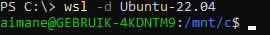
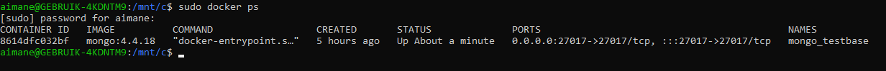
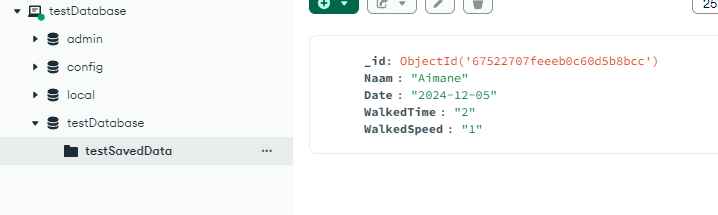
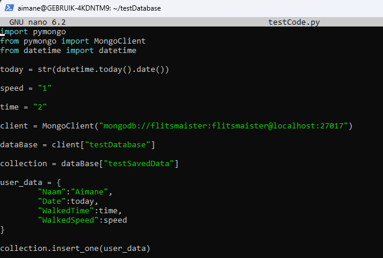
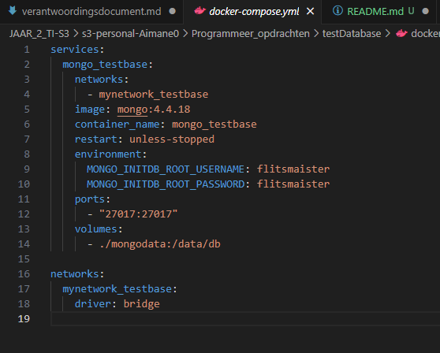

Ik heb een testDatabase op mijn eigen laptop via WSL, hiermee kon ik uitproberen en testen hoe MongoDB werkt!

- Eerst open ik mijn WSL via PowerShell in administrator mode

- Vervolgens gebruik ik docker ps om te tonen dat de database draaiende is

- Ook hiermee heb ik via mongodb compass en verbinding

- En op mijn WSL heb ik ook code geschreven om te oefenen met MongoDB

- Dit is de YML file die ik heb gebruikt met sudo docker compose up
