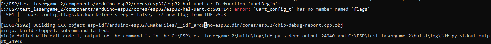

# Logboek S3 project Aimane Chakiri

## GEBRUIKTE TAGS
- [key drivers]
- [planboard]
- [requirements]
- [use case]
- [activity diagram]
- [keydriver chart]
- [functionele decompositie]
- [STD]
- [RAII]
- [IDF]

## 3 september 2024
- Op passen met paginas sluiten, perongeluk pagina gesloten waarin ik de key drivers aan het maken was\
Hierdoor moest ik alles weer helemaal opnieuw maken [key drivers]\
Dit topic is hier te vinden: https://github.com/2024-TICT-TV2SE3-24/s3-personal-Aimane0/tree/main/Project_persoonlijke_werk/Key_drivers

## 4 september 2024
- Vergeet niet het planboard bij te houden en elke dag te checken/bij te werken [planboard]\
Dit topic is hier te vinden: https://github.com/orgs/2024-TICT-TV2SE3-24/projects/17/views/2

- Deel linkjes op je planboard items [planboard]\
Dit topic is hier te vinden: https://github.com/orgs/2024-TICT-TV2SE3-24/projects/17/views/2

- De klant en de opdrachtgever zijn 2 verschillende entiteiten, de klant koopt echt het product en de opdrachtgever verkoopt het[key drivers]
Dit topic is hier te vinden: https://github.com/2024-TICT-TV2SE3-24/s3-personal-Aimane0/tree/main/Project_persoonlijke_werk/Key_drivers

- Maak een hierachie aan van de keydrivers, welke zijn het belangrijkste? Welke zijn een gevolg van iets anders? [key drivers]
Dit topic is hier te vinden: https://github.com/2024-TICT-TV2SE3-24/s3-personal-Aimane0/tree/main/Project_persoonlijke_werk/Key_drivers

## 5 september 2024
- Met groepsgenoten gediscusseerd wat de verschillen zijn tussen de keydrivers en requirements.\
Als ik het me goed herinner zei Rezan dat requirements uit keydrivers ontstaan. [key drivers][requirements]\
https://github.com/2024-TICT-TV2SE3-24/s3-personal-Aimane0/tree/main/Project_persoonlijke_werk/Business_documentatie/Functional_requirements

- Groepsgenoten waren tevreden over mijn requirements, merkte op dat het indelen van systemen met hun eigen requirements goed was. [requirements]\
https://github.com/2024-TICT-TV2SE3-24/s3-personal-Aimane0/tree/main/Project_persoonlijke_werk/Business_documentatie/Functional_requirements

- Groepsgenoten merkte op dat de database ook zijn eigen requirements nodig heeft [requirements]\
https://github.com/2024-TICT-TV2SE3-24/s3-personal-Aimane0/tree/main/Project_persoonlijke_werk/Business_documentatie/Functional_requirements
Als ik het me goed herinner zei Rezan dat requirements uit keydrivers ontstaan. [key drivers][requirements]

## 9 september 2024
- Use case diagram feedback van klasgenoten; link de database en het scorebord, want we willen een landelijke scorebord maken. [use case]\
https://github.com/2024-TICT-TV2SE3-24/s3-personal-Aimane0/blob/main/Project_persoonlijke_werk/Business_documentatie/Use_cases/Usecase_diagram_snelheidsdetector.jpg

- De verzorger wilt misschien ook toegang tot de database om bepaald onderzoek te doen over de bejaarden die zij verzorgen. [use case]\
https://github.com/2024-TICT-TV2SE3-24/s3-personal-Aimane0/blob/main/Project_persoonlijke_werk/Business_documentatie/Use_cases/Usecase_diagram_snelheidsdetector.jpg

- Vergeten volgens klasgenoten om 1 grote vierkant waar alle systemen in zitten te maken! [use case]\
https://github.com/2024-TICT-TV2SE3-24/s3-personal-Aimane0/blob/main/Project_persoonlijke_werk/Business_documentatie/Use_cases/Usecase_diagram_snelheidsdetector.jpg

- Heb eerst een diagram gemaakt, maar misschien moet ik beginnen met de beschrijvingen dus dat ga ik nu doen en opnieuw de diagram maken
Feedback van Bart 
    - Front end voor wetenschappers zodat ze niet met SQL hoeven te werken![requirements]

    - Landelijke database wilt Lucy mogelijk niet. Feedback van Bart [requirements]

    - Voor functionele requirement connectie met andere systeem moet er bij de non functionele requirements staan wat voor connectie dit is feedback van Bart [requirements]

    - HEEL BELANGRIJK! GEBRUIK DE RFID PASJES VAN VERZORGERS OM TE VOORKOMEN DAT HUN SNELHEID GEMETEN WORDT! [requirements]

    - F04 Functioneren van componenten is nog vaag en zegt niet wat functioneren is, beschrijft eigenlijk plug to play en niet functioneren is ook dubbel op als je kijkt naar requirement makkelijk gebruik [requirements]

## 10 september 2024
- Moeten de use cases niet beter uitgewerkt? Op het diagram staan er misschien te weinig acties, zo heeft de bewegingswetenschapper geen interactie met het data opslaan onderdeel van het databasesysteem maar vraagt het de data op uit de UI, dus misschien moet er een bolletje bij! Feedback van klasgenoten [use case]

- Dat extra bolletje moet er zijn watn de bewegingswetenschapper interact met een UI, die gaat geeen SQL gebruiken, die interact ook niet met het opslaan van de data natuurlijk! Dit heb ik zelf gereflecteerd en dit heb ik gecontroleerd en na gevraagd bij klasgenoten [use case]

## 11 september 2024
- NIEUWS OVER LUCY VAN BART!
    - HET MOET VOLDOEN AAN DE 10 METER TEST!
    - Lucy wilt dat we naar een bejaarden tehuis gaan
    - Ook langs bij SilverFit
    - Bedrading en sensoren moeten allemaal langs muren en plafond, niks waar mensen over heen kunnen lopen
    - Basis functionaliteit moet perfect zijn
    - Het herkennen van ouderen en verzorgers hoe goed dat lukt daar mag varriatie in en hoeft niet perfect, want dat is hoog gegrepen

- Feedback use cases van Bart [use cases]
    - Geef bewegingswetenschappers de kans de data te exporteren in een excel sheet bijvoorbeeld
    - Bejaarden is een actor van toont beste snelheden 
    - Extend van snelheid tonen en toont beste snelheden voelt niet goed en klopt niet haal de data voor het scorenbord uit de database! Dat klinkt logischer, anders heb je bijvoorbeeld data die dubbel is opgeslagen
        - Luke heeft mij gevraagd waarom de display de snelheid afleest van de database, veroorzaakt dit geen delay? Waarom leest de display het niet direct af van de detector
    
- Hagen merkt op dat het heel onoverzichtelijk, voeg kleuren toe, het moet makkelijk te scheiden zijn.
- Gebruik duidelijkere taal, na snelheid meten staat data doorsturen, dat is te onduidelijk, maak duidelijk dat het SNELHEID is wat je doorstuurt!
- Misschien iets anders gebruiken dan visual paradigm, krijg de kleuren van de balken en lijnen niet anders

## 12 september 2024
- Mijn activity diagram is vanuit de gebruiker, moet vanuit de software, feedback van Bart [activity diagram]

## 16 september 2024
- We moeten dingen toevoegen aan de requirements vanwege het feit dat we een nieuwe keydriver hebben, op verzoek van Bart, namelijk winst! [key drivers] [requirements]

## 17 september 2024
- Groepsfeedback:
    - Uit de keydriver chart merken we op dat de keydriver winst niet echt aan iets gekoppeld staat, we moeten dus requirements maken die er bij passen en dan de keydriver chart en tracebility diagram opnieuw maken als groep [keydriver chart]
    - Makkelijk gebruik/opzet komt vaak dubbel voor, connectie met andere systemen ook, dus misschien willen we daar 1 requirment van maken voor het gehele product in plaats van onder verdelen in systemen. Zo zien de charts er ook overzichtelijker uit! [keydriver chart]
    - Toevoeging van kleuren aan de keydriver chart en en het gebruiken van ronde bogen in de lijnen, omdat ze dan minder kruisen en over elkaar heen lopen [keydriver chart]

## 19 september 2024
SHOW AND TELL MET BART EN HARM
- Keydriver [key drivers]
    - De laatste keydriver staat erg laag, moet waarschijnlijk hoger, Lucy gaf aan dat veiligheid op nummer 1 staat.
    - Sterk dat de 10 meter test er in staat!
    - Keydrivers zien er netjes uit!

- Context diagram
    - Moet nu echt geupdate worden

- Functional Requirements [requirements]
    - Goedkoop mogelijk is een bullshit eis zoals Bart dat noemde. Prijs kwaliteit verhouding is een non functional requirement en voor non functional is die nog niet goed genoeg.
    - Keydriver winst hoeft niet perse een functional requirement, maar wel een non functional requirement.
    - Rationale van makkelijk gebruik klopt niet

- Non functional requirements [requirements]
    - Rationale van NF01 aanpassen, KM/u is kleiner dan MS/u
    - Mist een hele belangrijke NF, hoe vaak en hoe nauwkeurig moet de snelheidsdetector meten? De sample rate en nauwkeurigheid, ook de range.
    - NF05, zoek bronnen wat leesbaar is voor ouderen! Er bestaan daar richtlijnen over!
    - NF16, RFID bandjes is te veel design die mag er uit!
    - Wat is real-time? Geef delay time tussen metingen en weergave op borden.
    - NF10, de rationale klopt niet, de rationale hoort te zijn dit is 1 van de leerdoelen van de HU, dit geldt ook voor NF09 IR, ook NF03 wireless connectie
    - NF11 Ubuntu is ook opgelegd door de HU. 
    - NF12 Raspberry Pi veranderen naar lokaal gebruik.
    - Docker is opgelegd vanaf de HU

- Use cases [use case]
    - Dingen aanpassen naar SVG
    - UC01
        - Niet de bejaarden, maar de snelheidsdetector doet de meeting!
        - Je wilt rekening houden met de AVG issues ivm het opslaan van mensen hun namen.
        - Voor onderzoek wil je anonieme data hebben, voor verzorgers wil je wel de namen voor het verzorgen
        - Er ontbreekt een stap waarin de bejaarden geidentificeerd wordt
    
    - UC03 snelheid meten
        - Je ziet gelijk dat er een disconnect is
    
- Traceability diagram
    - F04 verwijderen uit de traceability diagram

- Key driver chart [keydriver chart]
    - Keydriver winst hoeft niet perse een functional requirement, maar wel een non functional requirement waar een lijn naar toe loopt.
    - Bart denkt dat die er wel goed uit ziet

- feedback rezan, van marius 
gebruik werkwoorden, de 4 systemen die we hebben onderverdelen apart maken en dan samen voegen, database hoort er niet bij want dat is niet onderdeel van de software die we maken. Je programmeert de database niet.[functionele decompositie]

## 25 september 2024
- feedback hagen
    - beschrijf in je use cases niet alleen dat je snelheden gebruikt, maar dat je ook andere data wilt opslaan zoals wiens snelheid het is en timestamps [use case]
    - voeg een use case toe om aan te geven dat je gebruikers herkent [use case]
    - snelheid door versturen: het kan zinvol zijn om een use case zoals dit te hebben als de het versturen lastig is [use case]
    - UC06: toont snelheden op UI moet uit database vakje en een eigen vakje krijgen! [use case]
    - Samen met Hagen UC06 aangepast! [use case]

## 26 september 2024
- feedback bart en harm: [use case] [planboard] [requirements] [key drivers]
    - altijd hyperlink.
    - haal de scroll templates weg bij de verslagen.
    - reflecties zijn goed gemaakt en duidelijk.
    - harm houd van humor, vondt zonnebrillen leuk.
    - help elkaar met elkaars groeipunten en geef elkaar de mogelijkheid in om te verbeteren.
    - als een leidend figuur mist pak alle taken op die er missen.
    - voor volgende verslag gebruik sprint-verslag-detail.md als voorbeeld. mogen wel verder met wat we doen.
    - het is "vet" dat we de diagrams samenvoegen.
    - op scrumboard zetten wat nog externe taken zijn.
    - we moeten kijken naar lange termijn planning.
    - aantal onderdelen testen.
    - stakeholders in key drivers moeten overeenkomen met system context.
    - scoreboard bespreken met lucy.
    - design keuzes hangen af van de eis non-functional requirement.
    - rationale moet echt een reden zijn waarom de requirement er is.
    - belans vinden met hoeveel mensen je het maakt en dan laat reviewen.
    - use case diagram nakijken met database en ui.

## 21 oktober 

- Boundary objecten die gebruikt worden door een control aangeven als een ander object. Een display met functies aangeven als bijvoorbeeld display.clear(); zodat het duidelijk is dat de functie clear afgeleid is van het object display die gebruikt wordt door de control klasse. Dit gaat om https://canvas.hu.nl/courses/44569/assignments/329473/submissions/81322 [STD]

- De 10 seconde timer hoort een onderdeel te zijn van de toestand waar er op een toetsdruk wordt gewacht, alle toetsen moeten terug geleiden naar deze toestand. Dit gaat om https://canvas.hu.nl/courses/44569/assignments/329473/submissions/81322 [STD]

## 5 november
Vragen die ik binnenkort moet stellen ivm dingen die ik op heb gemerkt in uitwerkingen:

- https://canvas.hu.nl/courses/44569/assignments/326084 ; WAT IS DE THROW FUNCTIE EN WAT DOET HET? [RAII]
    - beantwoord door Marius in; https://canvas.hu.nl/courses/44569/assignments/326084/submissions/81322

- https://canvas.hu.nl/courses/44569/assignments/329525/submissions/81322 ; HOE WERKT DE CONSTRUCTOR IN DE UITWERKING VAN DEZE OPDRACHT? & NA VRAGEN WAAROM ER 2 ENUMS WORDEN AANGEMAAKT VOOR DE STATE EN NIET 1 & WAAROM HEEFT ALLEEN INSTELLINGEN EEN REFERENCE TEKEN (OMDAT HET IN DE CONSTRUCTOR ZIT?) & WAT IS FOR(;;)?[STD]
    - beantwoord door Marius in; https://canvas.hu.nl/courses/44569/assignments/329525/submissions/81322

# 20 november
troubleshooting IDF:

de fout melding betekent dat er geen flag onderdeel is van de struct uart_config. Door deze uit te commenten op line 501, waarin je deze member als false declared zou dit hopelijk de IDF en het builden moeten fixen [IDF]