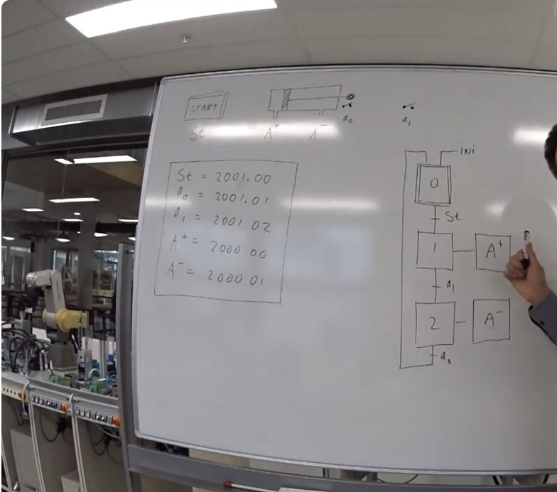
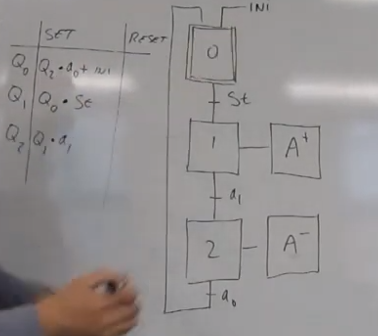
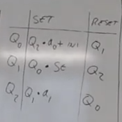
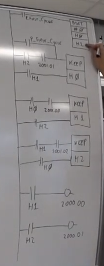

## Les 1:

- Blauwe kasten die we zien staan zijn PLC's
    - Ze hangen aan een netwerk, kunnen onderling communiceren.
    - Met elke PC is te verbinden aan elke PLC
    - Voorbeelden PLC; liften gebruiken er van, verkeers punten. PLC kan van alles quasi-tegelijkertijd 
    - Industrie norm; IEC61131 norm 
        - Ladder
        - ST
        - FB
        - IL
        - SFC 

- CX-programmer
    - control + w ; on and offline
    - control + 1 ; stop
    - control + 4 ; run
    - control + t ; transfer, programma in je PLC pleuren
    - shift + control + t = download van PLC bestand naar je PC

    - om te programmeren moet je offline zijn! online kun je alleen mee kijken met je PLC

    - schakelaars zitten op 2001.00 / tm 15
    - leds zitten op 2000.xx / tm 15

    - de hello world van een PLC
        - schakelaar aan ledje koppelen!

    - cyclus tijd, hoe lang het duurt voordat PLC alles heeft gelezen en dit is altijd het zelfde

    - de PLC leest altijd van boven naar beneden

    - KEEP blok; bovenste schakelaar set een LED om aan te doen, het onderste blok is een reset en is dominant. Op het scherm zie je onder het blokje een 1 of een 0 die geeft de staat aan

## Aantekeningen gemaakt als voorbereiding van les 2: https://www.youtube.com/watch?v=Yvv7myaJdtk&ab_channel=BartBozon

- Dit gaat om de sequential function chart

- Veel van de objecten van de mini fabriek hebben een begin en eind schakelaar!

- Output wordt vaak aangegeven met een hoofdletter

- Eindschakelaars die horen bij een of andere combinatie van uitgangen de zelfde letter te geven maar dan KLEIN!

- De namen kun je vervolgens koppelen aan harde adressen in je PLC, IO (input/output) lijst

- 2001.xx = input, 2000.xx = output

- Je moet aan schuif voorwaardes voldoen wil je naar de volgende stap, aan het begin heb je ook een ini (initalizatie) stap

- Teken eerst hoe het PLC proces moet lopen op papier!
    - 

- Je kunt in een tabel ook per stap de set en reset voorwaardes opschrijven!
    - SET voorwaardes voor stap 1 zijn bijvoorbeeld in het plaatje boven st en 0, want st werkt alleen als je dan ook in stap 0 zit.
    - SET voorwaardees voor stap 2 zijn dus a1 en in stap zitten!
    - Dit is hoe je het noteert;
        - 
        - de "+ ini" staat voor OF dus het is geen plus in de zin van q2 en a0 moeten samen met ini gedaan worden het staat voor Q0 set door ini OF q2 * a0
    
    - RESET voorwaardes zijn heel simpel, namelijk de stap die volgt is de reset voorwaarde zoals te zien op het plaatje;
        - 

- In de PLC zit een singaal, heet P_First_Cyle dit is een ingang, hier zit geen schakelaar in maar het is een korte bit signaal die je kunt gebruiken ter initalizatie dit kan handig zijn om een cycle opnieuw te starten zodat je weet dat niks anders aan staat als je opnieuw begint

- We kunnen alles op de volgende manier resetten, de functie; bset (block set), hiermee kun je een hele lap geheugen een bepaalde waarde geven. Je kunt bijvoorbeeld ALLES een 0 geven zodat alles uit staat
    - 
    - Hier zie je helemaal boven dat P_First_Cycle gebruikt wordt om de bset te gebruiken om alles op 0 te zetten!

- Stippel lijn box bij stap2 betekent dit hoef je niet te programmeren maar geeft wel een beweging aan die je systeem maakt!

## Aantekeningen uitleg LES 2;

- BIJ STAP 0 DOE JE NOOIT IETS! STAP 0 HEEFT NOOIT EEN ACTIE!

- Stel je moet een beslissing nemen om iets goed of af te keuren?
    - Op basis van een beslissing kun je een enkele horizontale lijn gebruiken om aan te geven dat er een splitsing is gebaseerd op de voorwaarde er voor en deze komen ook weer terug samen op een enkele horizontale lijn!!!!!
        - dit heet een of lijn
    
    - je hebt ook dubbele lijnen die horizontaal lopen!
        - Deze maakt het mogelijk verschillende acties tegelijk uit te voeren!

- Een lus mag NOOIT maar 2 stappen hebben! dit kan een deadlock vormen, een lus moet altijd MINSTENS 3 stappen groot zijn
    - als je een lus hebt met 2 stappen, voeg dan een lege loze stap toe om er 3 van te maken