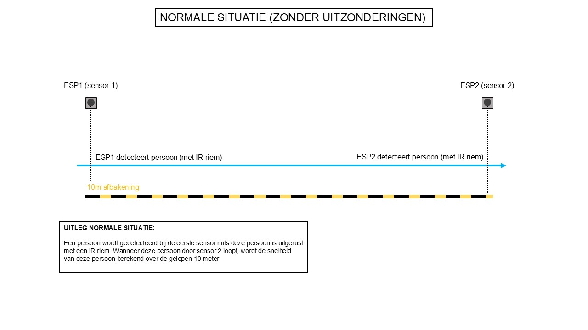
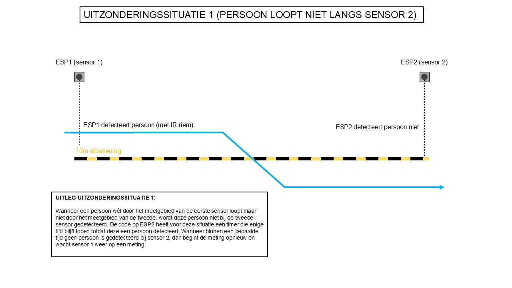
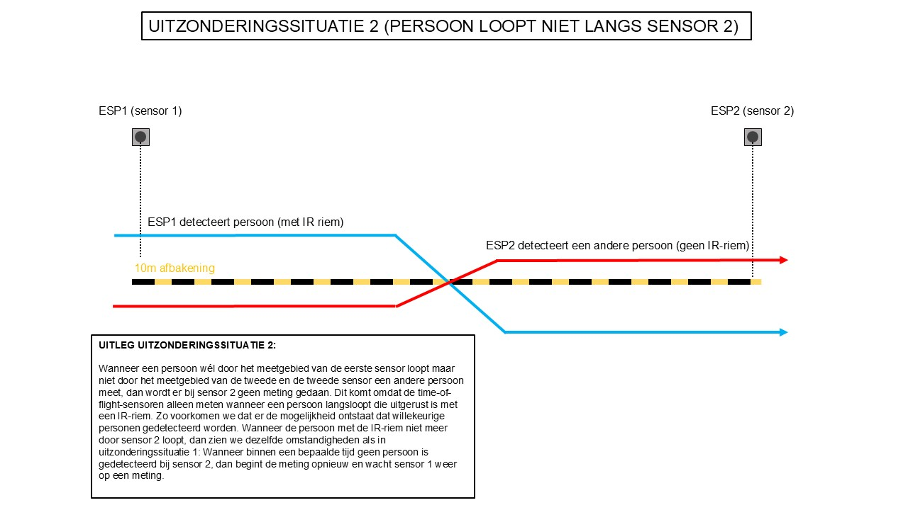
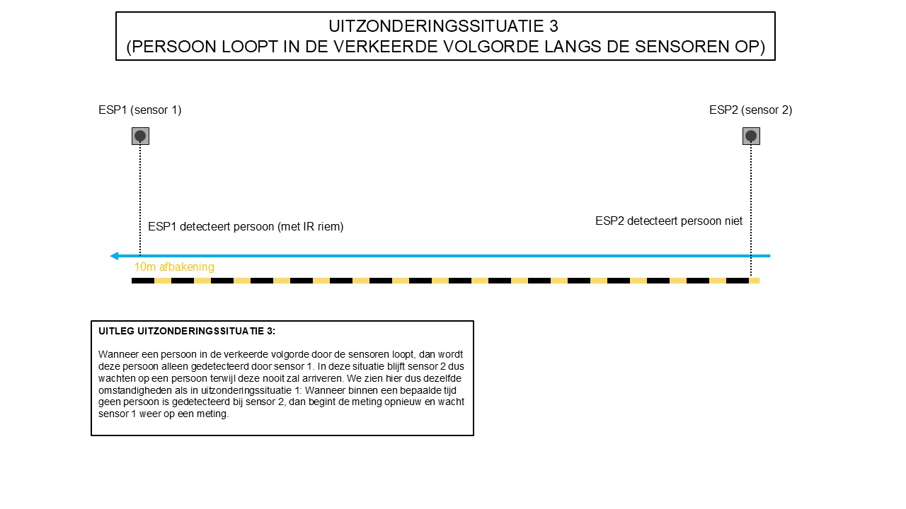
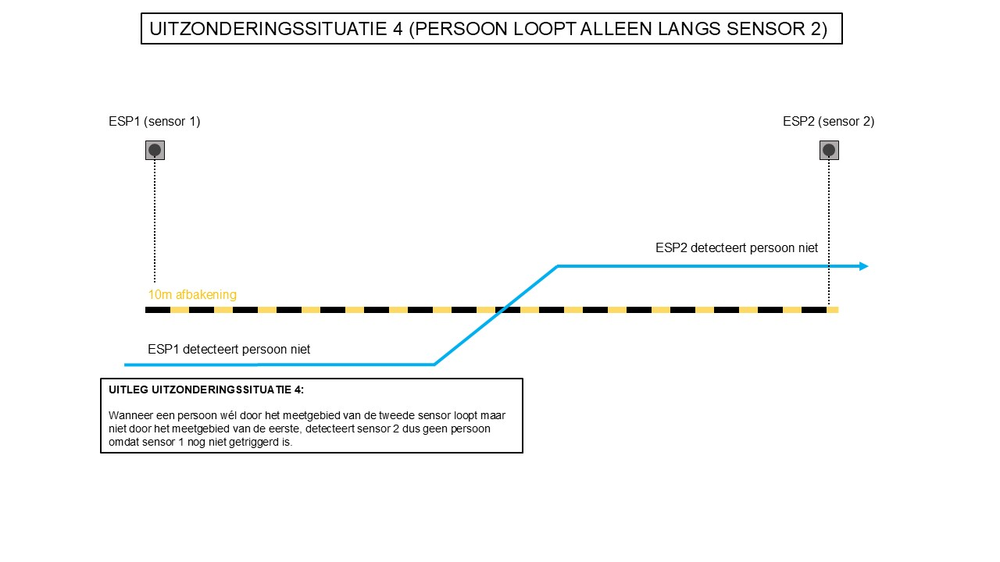

# Uitzonderingssituaties voor de meting over 10 meter.

## Uitleg:

Voor de meting van de snelheid van een persoon over de afstand van 10 meter zijn hieronder een aantal situaties weergegeven die mogelijke uitzonderingen van de meting tonen.

## Situaties:

