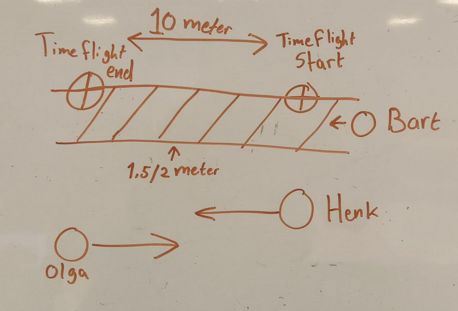

Sonar vs Time of Flight.

Als groep wilde wij een sonar sensor gebruiken om twee posities van een gebruiker te meten en de tijd tussen de twee positites, om vervolgens met deze informatie een snelheid te meten.
Al gauw kwamen wij er achter dan dit niet heel haalbaar is, sonar pikt namelijk ook andere mensen op in het bereik dat het heeft in de vorm van een cone, dit kan tot complicaties zorgen.
Op basis van feedback verkregen van Marius zijn wij overgestapt naar Time of Flight sensors.

Een time of flight sensor scant recht naar voren toe, in plaats van in een cone zoals een sonar sensor.
Vanwege de manier hoe een time of flight sensor naar voeren toe scant kunnen we makkelijker mensen die niet de speeddetector gebruiken uitsluiten van het proces. 

Ons idee gaat als volgt;

- Er hangen twee sensors aan de muur aan de zelfde kant, deze staan op 10 meter van elkaar af.
- Één van de twee sensors is het start punt, de andere is het eindpunt.
- We trekken met een gekleurd tape een lijn op de vloer, deze geeft aan dat je tussen de tape en de muur moet lopen voor de speeddetector om deze goed te laten functioneren.
- De time of flight sensor filtered alle mensen die het langs ziet lopen, buiten het aangegeven pad, uit. Op deze manier kan alleen de gebruiker die binnen de nodige afstanden loopt de speeddetector gebruiken.

- Plaatje als schets van onze opstelling

 In het plaatje zou onze opstelling zo werken dat bejaarden Henk en Olga ook door het gangpad lopen, maar op een grotere afstand dan nodig is om de ESP hun taken te triggeren. Wij hopen op deze manier complicaties te voorkomen, zoals dat de speeddetector de verkeerde personen scanned of dat verzorgers gescanned worden.