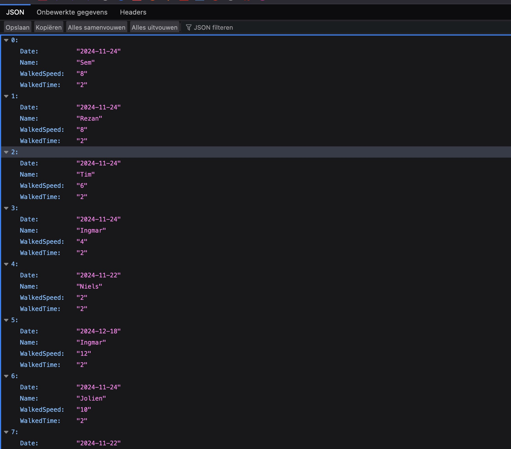

# Wifi API Test

## Inleiding
Voor de datastroom van de Database naar de webapp hebben wij gekozen voor een Flask API. Om te controleren of deze API de data goed ophaald uit de database, zodat het verwerkt kan worden door de webapp, gaan wij de API testen aan de hand van dit testplan. 

## Doel van de test
Deze test richt zich op het controleren of de data volledig en compleet doorkomt naar de webpagina zodat dit kan worden verwerkt.

## Succescriteria
De test wordt als succesvol beschouwd als de API pagina goed alle data uit de Database in JSON format ophaald en regelmatig bijwerkt

## Benodigheden
- Device met de Flask API runnende
- Device met de MongoDB server runnende
- Device met de webapp runnende

## Installatie en voorbereiding

1. MongoDB installeren
2. Installeer een IDE als VSCode
3. Installeer Tailscale op je laptop via deze guide: https://tailscale.com/download
4. Maak een account aan bij ze en click daarna hierop om te zorgen dat de Pi in je netwerk zit: https://login.tailscale.com/admin/invite/SgGcnZeVv16 

## Test voor API aanzetten

1. Open je IDE en clone deze repo: https://github.com/2024-TICT-TV2SE3-24/s3-project-flitsmeister.git

2. Navigeer naar de Dashboard folder en run 'npm install'

3. Navigeer naar de flask folder en installeer een virtual environment via de terminal en activeer deze 

4. Run de volgende command in terminal in de flask folder: 'pip3 install -r requirements.txt'  

5. Zorg dat de Raspberry Pi waar de database opstaat aan staat

6. In de flask folder, run "python3 app.py" 

7. Nu zie je de url van de flask api in de terminal verschijnen, dit zal op "localhost:5000" zijn. Navigeer hiernaar in je browser.

8. Omdat het een zelf uitgegeven certificaat 

## Test resultaten

- Eerste test van de API, 09/01/2025.

    - De API runt lokaal op de laptop.
    - De database runt op de Pi
    - Je kan in je browser 

    
