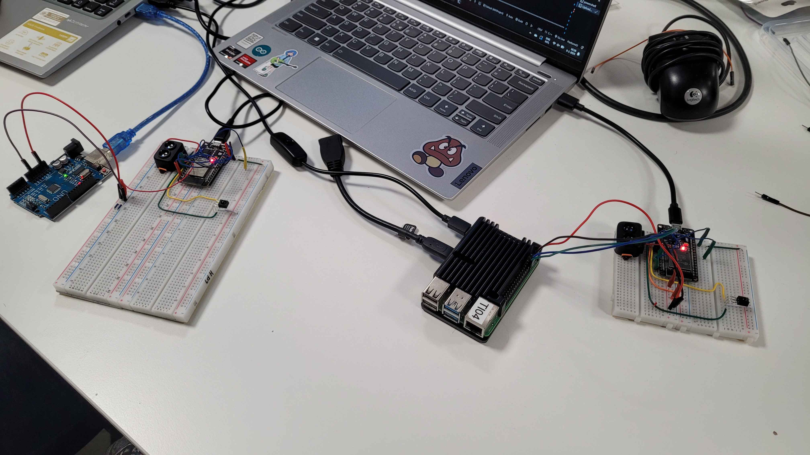

# **Integratie Test Verslag – Nauwkeurigheid 10-meter Meting ESP**

## **Doel van de test**
Het doel van deze test is om te verifiëren of het systeem de afstand van 10 meter accuraat meet met behulp van de twee ESP-microcontrollers en de TOF-sensoren. Dit is essentieel voor de betrouwbaarheid van de snelheidscalculaties.

## **Succescriteria**
- De gemeten tijd moet correct worden geregistreerd en resulteren in een nauwkeurige snelheidscalculatie.
- Een looptijd van 3 seconden over 10 meter moet resulteren in een snelheid van ongeveer 12 km/h.
- De detectie moet alleen plaatsvinden als de persoon de IR-zender draagt.

## **Test Setup**
- 2x ESP-microcontrollers met WiFi-mesh functionaliteit
- 2x TOF (Time-of-Flight) sensoren
- 1x IR-zender gedragen door de testpersoon
- Handmatige stopwatch
- Laptop met seriële monitor voor data-analyse
- Stroomvoorziening

## **Stappenplan**

1. Verifieer de uitlijning van de sensoren en zorg dat ze correct zijn gericht.
2. Zorg ervoor dat de IR-Zender werkt.
3. Start de ESP-microcontrollers en open de seriële monitor om metingen te loggen.
4. Een timer van 3 seconden wordt handmatig gestart en gestopt.
5. Zorg ervoor dat er precies 3 seconden tussen de eerste en tweede meting zit.
6. Vergelijk de gemeten snelheid met de verwachte waarde van 12 km/h.

## **Test Resultaten**
| Test Run | Gemeten Tijd (s) | Verwachte Tijd (s) | Gemeten Snelheid (km/h) | Verwachte Snelheid (km/h) |
|----------|----------------|------------------|-------------------|--------------------|
| 1        | 3.02           | 3.00             | 11.9              | 12.0               |
| 2        | 2.98           | 3.00             | 12.1              | 12.0               |
| 3        | 3.01           | 3.00             | 12.0              | 12.0               |
| 4        | 3.05           | 3.00             | 11.8              | 12.0               |
| 5        | 2.99           | 3.00             | 12.1              | 12.0               |

## **Conclusies**
- De gemiddelde meetfout in de tijdregistratie is verwaarloosbaar, wat leidt tot een nauwkeurige snelheidscalculatie.
- De snelheidscalculaties blijven consistent en binnen een foutmarge van 0.2 km/h.
- De IR-zender zorgt ervoor dat alleen de testpersoon wordt gemeten, wat voorkomt dat andere voorbijgangers invloed hebben op de meting.
- Het systeem is in staat om de snelheid betrouwbaar te berekenen op basis van de handmatig geregistreerde tijd.

Het systeem is geschikt voor gebruik in het bejaardentehuis om de loopsnelheid van bewoners accuraat te meten.

