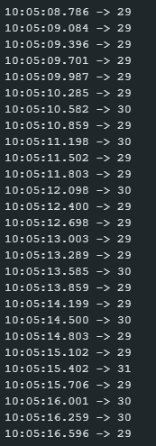
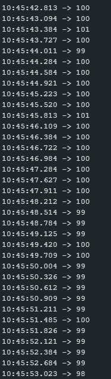
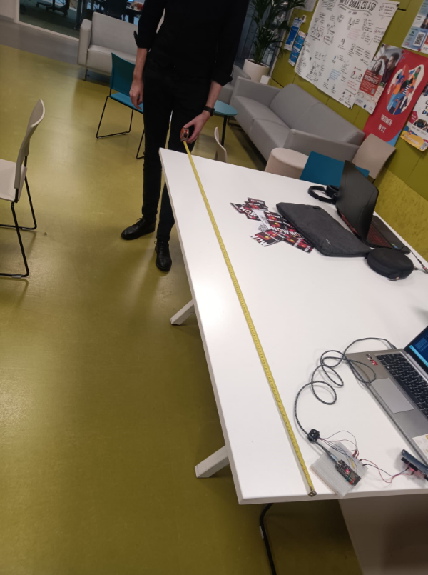
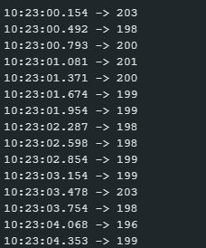

# Measurements test

## Inleiding
Als groep willen we de prestaties van onze componenten testen. Daarom voeren we enkele eenvoudige tests uit, zoals deze. Het doel van deze test is om de nauwkeurigheid van de afstandsmetingen van de SJ-GU-TF-Luna A03 te controleren.

## Doel van de test
Deze test richt zich op het bepalen van de nauwkeurigheid van de ToF Luna-sensor bij verschillende afstanden. In de datasheet van de ToF Luna-sensor wordt een indicatie gegeven van de mogelijke afwijkingen. We zullen onze testresultaten vergelijken met de specificaties in de datasheet.

## Succescriteria
De test wordt als succesvol beschouwd wanneer de gemeten afwijkingen overeenkomen met de waarden die in de datasheet worden vermeld. Als de afwijkingen groter zijn dan de gespecificeerde waarden in de datasheet, wordt de test als mislukt beschouwd. De foutmarge mag dus niet groter zijn dan wat in de datasheet van de TF-Luna is gespecificeerd.

## Test setup
- Meerdere linialen of een meetlint om de metingen van de TF-Luna te verifiëren.
- Een object dat door de TF-Luna wordt gemeten op verschillende afstanden.
- Simpele code die de gemeten afstand weergeeft. [link naar de code](https://github.com/2024-TICT-TV2SE3-24/s3-project-flitsmeister/blob/main/Tests/MeasurementTests/TFSensorTest.ino)
- De code moet in elke iteratie van de loop worden aangepast om de if-statement anders te laten functioneren; de foutmarge moet handmatig worden ingevoerd.
- Een functionerende ToF Luna-sensor, aangesloten op een stroomvoorziening.
- Een Arduino Uno om de gemeten waarden weer te geven, de code op de ToF Luna-sensor toe te passen en stroom te leveren aan de sensor.

## Stappenplan
1: Pas de benodigde code aan. Er zijn drie variabelen:
    - Goal: De precieze afstand die gemeten hoort te worden.
    - minValue: De minimale toegestane afwijking naar beneden.
    - maxValue: De maximale toegestane afwijking naar boven.

2: Wanneer wij een afstand hebben ingevoerd in de code bouwen wij een constructie die precies op die afstand ligt. Gebruik hiervoor linialen of meetlinten. 

3: Sluit vervolgens de ToF Luna sensor aan op de Arduino uno via I2C.

4: Upload de code naar de Arduino Uno toe, zodat de meetingen van de ToF Lunar sensor in een serial monitor geprint worden

5: Houdt een object aan de ene kant van het meetling of liniaal die je gebruikt, de ToF Luna sensor aan de andere kant.

6: Richt de ToF Luna sensor op het object aan de andere kant van het meetlint of liniaal

7: Bekijk op de serial monitor wat er geprint wordt. Als er een getal uit komt betekent het dat de meeting door de ToF Luna sensor binnen de minimale en maximale waarde valt. Indien "Distance is outside of margin of error" geprint wordt betekent dit dat de meeting buiten de minimale en maximale waarde valt.

## Aangegeven specificaties in de datasheet
De datasheet die wij gebruiken is: \
https://files.seeedstudio.com/wiki/Grove-TF_Mini_LiDAR/res/SJ-PM-TF-Luna-A03-Product-Manual.pdf

- De range van de ToF Luna is 0.2 tot en met ongeveer 8 meter.
- De eenheid waarin gemeten wordt is in centimeters
- De afwijking kan +- 6 centimeter zijn als er gemeten wordt tussen 0.2 en 3 meter.
- De afwijking kan +- 2% zijn als er gemeten wordt tussen de 3 en 8 meter.

## Automatiseren van de test
Gezien de beperkte tijd tot de deadline, hebben wij helaas geen geautomatiseerde test beschikbaar. Wat we echter wél kunnen doen, is adviseren over hoe deze test geautomatiseerd kan worden.

Een mogelijke oplossing is om een apparaat te ontwerpen dat op een band of rail van ongeveer 8 meter lang heen en weer beweegt met een regelmatige interval, bijvoorbeeld om de paar seconden.

Wanneer je de TF Luna (of een vergelijkbare sensor) stevig bevestigt en richt op een object dat op deze band heen en weer beweegt, kan dit een betrouwbare manier zijn om metingen te automatiseren en te testen.

## Test resultaten

- Eerste meeting, 09/12/2024, 30 centimeter.

    - De meeting:
    
    - De gemeten waarden variëren tussen 29 cm en 30 cm, met één uitschieter naar 31 cm:
    
    - Het verschil van 1 centimeter is niet meer dan de gegeven afwijkingen in de datasheet.
    - Een verschil van 1 centimeter op een meeting van 30 centimeter is een verschil van 0.333% 

        ---

- Tweede meeting, 09/12/2024, 1 meter.
    - De meeting:
    
    - De gemeten waarden variëren tussen de 100 en 99 centimeter, met één uitschieten van 101.
    
    - Het verschil van 1 centimeter is niet meer dan de gegeven afwijkingen in de datasheet.
    - Een verschil van 1 centimeter op een meeting van 100 centimeter is een verschil van 1%

- Derde meeting, 06/01/2025, 2 meter.
    - De meeting:\
    

    - De gemeten waarden variëren tussen de 196 en 203, dit lag vooral aan dat het lastig is de meeting perfect uit te voeren zonder je handen veel te bewegen.\
    
    - Het verschil dat we zien is zowel + 1 en 3 ene ook - 1, 2 en 6.

    - Dit zijn verschillen van 0.5%, 1%, 1.5% en 3%

## AI verklaring
Alle inhoud is door mij zelf bedacht, wel is er AI gebruikt om de spelling en grammatica van deze test te controleren.
