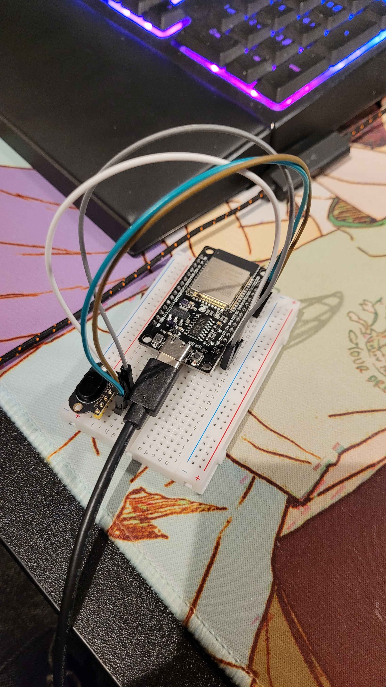
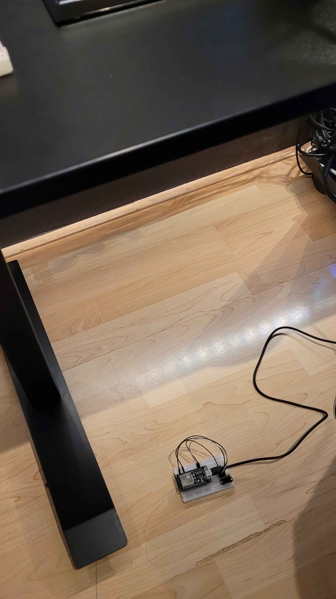
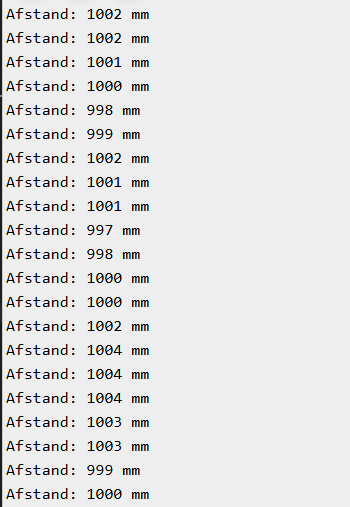

# Testplan voor TOF400C-VL53L1X Sensor

## Inleiding
Dit testplan beschrijft de testprocedure voor de **TOF400C-VL53L1X** Time-of-Flight sensor, die als **Plan B** was bedoeld voor het project in het geval dat de primaire TOF-sensor niet zou functioneren.

## Doel van de Test
Het doel van deze test is om de werking van de **TOF400C-VL53L1X** sensor te valideren met een **ESP32** microcontroller. Specifiek willen we testen:
- Of de sensor correct wordt herkend via I²C.
- Of afstandsmetingen consistent en correct zijn binnen de gespecificeerde meetrange.
- Of de sensor betrouwbaar werkt onder verschillende lichtomstandigheden.
- De foutafhandeling wanneer de sensor verkeerd is aangesloten of buiten het meetbereik functioneert.

## Succescriteria
De test is geslaagd als:
- De sensor correct wordt herkend via I²C en zijn adres wordt gedetecteerd.
- De gemeten afstanden binnen een acceptabele marge van afwijking liggen (max. 5mm foutmarge).
- De sensor stabiele metingen uitvoert.
- Er geen onverwachte crashes of foutmeldingen optreden.

## Test Setup
**Benodigde hardware:**
- ESP32
- TOF400C-VL53L1X sensor
- Breadboard en wires
- **Arduino IDE** en de **VL53L1X** library

## Stappenplan
### **1. Hardware Setup**
1. Verbind de TOF400C-VL53L1X met de ESP32 volgens het onderstaande schema:

    | TOF400C-VL53L1X Pins | ESP32 Pins |
    |----------------------|------------|
    | VCC                  | 3.3V of 5V |
    | GND                  | GND        |
    | SDA                  | GPIO21     |
    | SCL                  | GPIO22     |

2. Controleer met een **multimeter** of de juiste voedingsspanning aanwezig is op de sensor.

### **2. Software Setup**
1. Open de **Arduino IDE** en installeer de **VL53L1X** library.
2. Upload het volgende testprogramma naar de ESP32:

```cpp
#include <Wire.h>
#include <VL53L1X.h>

VL53L1X sensor;

void setup() {
    Serial.begin(115200);
    Wire.begin(21, 22);

    if (!sensor.init()) {
        Serial.println("Sensor niet gevonden!");
        while (1);
    }
    sensor.setTimeout(500);
    sensor.startContinuous(50);
}

void loop() {
    Serial.print("Afstand: ");
    Serial.print(sensor.read());
    Serial.println(" mm");
    delay(100);
}
```

### **3. Testuitvoering**
1. Open de **Seriële Monitor** in de Arduino IDE.
2. Controleer of de sensor correct wordt herkend en meetwaarden retourneert.
3. Plaats een object op vaste afstand (bijvoorbeeld 100 cm) en noteer de metingen.

## Testresultaten

### Testopstelling:
De setup op het breadboard.



Voor de test over 1 meter (1000mm), heb ik mijn bureau afgesteld op 1 meter hoogte.




### Resultaten in de serial monitor:
De resultaten blijven binnen de 5 mm foutmarge.



## Conclusie
Na deze tests kunnen we dus beoordelen dat de **TOF400C-VL53L1X** geschikt is als **Plan B** in het project. De sensor voldoet aan de succescriteria. De metingen blijven namelijk binnen de eerder genoemde foutmarge van 5 mm. De sensor is zeker geschikt als alternatief voor wanneer de TOF-Luna niet functioneert.

