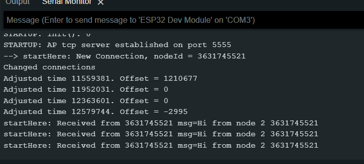
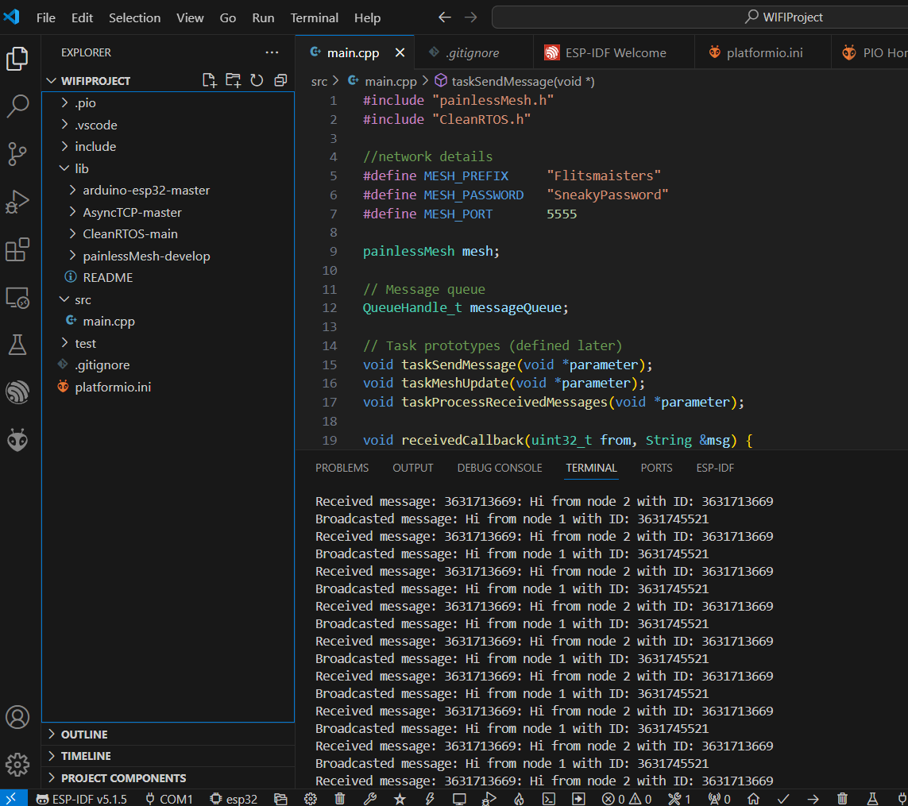

# Wifi-Mesh Test

## Inleiding
Voor de communicatie tussen de ESPs in het project viel de keuze op Wifi-Mesh. In dit testrapport wordt beschreven hoe deze communicatie is getest.

## Doel van de test
Deze test richt zich op het werkende krijgen van een Wifi-Mesh voor de communicatie tussen onze ESPs.

## Succescriteria
De test wordt als succesvol beschouwd wanneer de twee ESPs met elkaar kunnen communiceren via Wifi-Mesh. Tevens moet de Wifi-Mesh samenwerken met CleanRTOS.

## Benodigheden
- Twee of meer ESPs.
- Testcode voor het testen van de Wifi Mesh.

## Stappenplan
Het stappenplan wat voor de Wifi-Mesh test is gevolgd, is te vinden op de volgende site:
https://randomnerdtutorials.com/esp-mesh-esp32-esp8266-painlessmesh/

## Installatie en voorbereiding

1. Arduino IDE installeren.
2. ESP32/ESP8266 board toevoegen:  
   - ESP32: Voeg deze URL toe in Preferences → Board Manager:  
     ```
     https://raw.githubusercontent.com/espressif/arduino-esp32/gh-pages/package_esp32_index.json
     ```
3. PainlessMesh library installeren via Library Manager in Arduino IDE.  

## Test voor mesh netwerk opzetten

1. Open Arduino IDE en maak een nieuw bestand.  

2. Kopieer en plak de volgende code:  

```
/*
  Rui Santos
  Complete project details at https://RandomNerdTutorials.com/esp-mesh-esp32-esp8266-painlessmesh/
  
  This is a simple example that uses the painlessMesh library: https://github.com/gmag11/painlessMesh/blob/master/examples/basic/basic.ino
*/

#include "painlessMesh.h"

#define   MESH_PREFIX     "whateverYouLike"
#define   MESH_PASSWORD   "somethingSneaky"
#define   MESH_PORT       5555

Scheduler userScheduler; // to control your personal task
painlessMesh  mesh;

// User stub
void sendMessage() ; // Prototype so PlatformIO doesn't complain

Task taskSendMessage( TASK_SECOND * 1 , TASK_FOREVER, &sendMessage );

void sendMessage() {
  String msg = "Hi from node1";
  msg += mesh.getNodeId();
  mesh.sendBroadcast( msg );
  taskSendMessage.setInterval( random( TASK_SECOND * 1, TASK_SECOND * 5 ));
}

// Needed for painless library
void receivedCallback( uint32_t from, String &msg ) {
  Serial.printf("startHere: Received from %u msg=%s\n", from, msg.c_str());
}

void newConnectionCallback(uint32_t nodeId) {
    Serial.printf("--> startHere: New Connection, nodeId = %u\n", nodeId);
}

void changedConnectionCallback() {
  Serial.printf("Changed connections\n");
}

void nodeTimeAdjustedCallback(int32_t offset) {
    Serial.printf("Adjusted time %u. Offset = %d\n", mesh.getNodeTime(),offset);
}

void setup() {
  Serial.begin(115200);

//mesh.setDebugMsgTypes( ERROR | MESH_STATUS | CONNECTION | SYNC | COMMUNICATION | GENERAL | MSG_TYPES | REMOTE ); // all types on
  mesh.setDebugMsgTypes( ERROR | STARTUP );  // set before init() so that you can see startup messages

  mesh.init( MESH_PREFIX, MESH_PASSWORD, &userScheduler, MESH_PORT );
  mesh.onReceive(&receivedCallback);
  mesh.onNewConnection(&newConnectionCallback);
  mesh.onChangedConnections(&changedConnectionCallback);
  mesh.onNodeTimeAdjusted(&nodeTimeAdjustedCallback);

  userScheduler.addTask( taskSendMessage );
  taskSendMessage.enable();
}

void loop() {
  // it will run the user scheduler as well
  mesh.update();
}
```
3. Selecteer het juiste board en poort in Hulpmiddelen.

4. Upload de code naar elk ESP32/ESP8266 apparaat.

6. Open de seriële monitor (115200 baud).

7. Zet meerdere ESP’s aan en controleer de communicatie.

## Test resultaten

- Eerste test in de Arduino IDE, 26/11/2024.

    - De Wifi-Mesh is opgezet per ESP.
    - In de Serial Monitor is te zien dat de ESPs met elkaar communiceren.

    

- Tweede test met CleanRTOS, 2/12/2024.

    - Voor de Wifi-Mesh in het project is eigen code geschreven. De mesh is opgezet per ESP, inclusief werking met CleanRTOS.
    - In de Serial Monitor is te zien dat de ESPs met elkaar communiceren.

    
